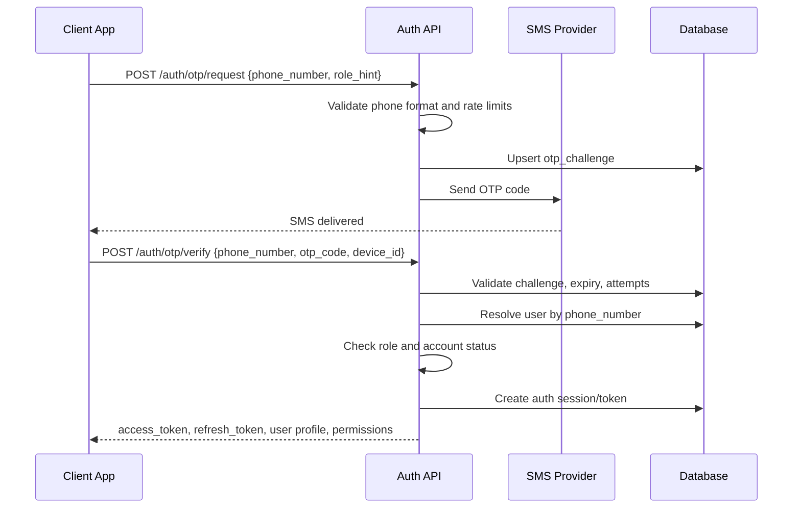
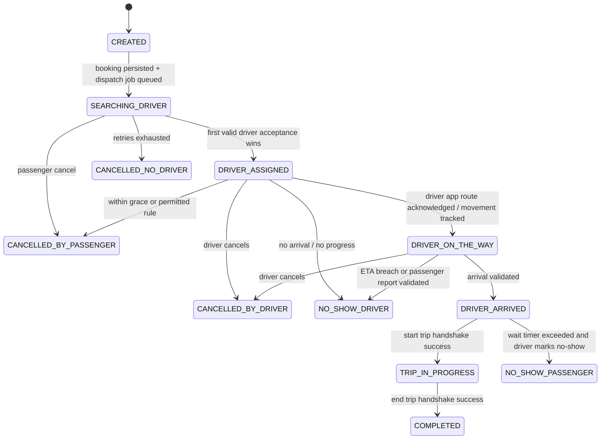
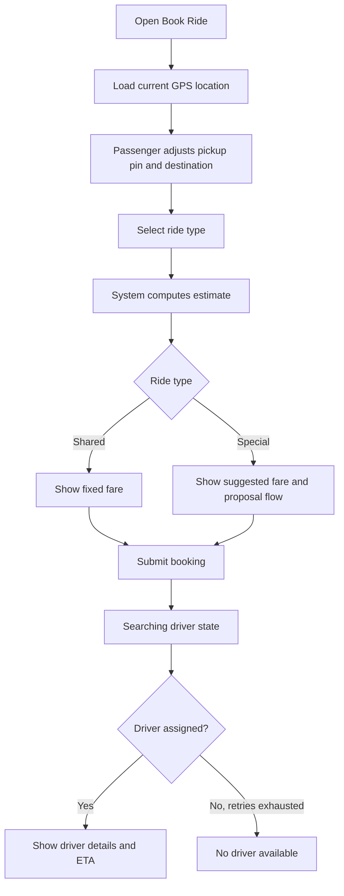

# Kabacan Smart Tricycle Dispatch System
## Product Requirements Document (Developer-Ready Spec, Exhaustive Revision)

---

# 1. Document Purpose and Reading Contract

This document is the authoritative product and system specification for the Kabacan Smart Tricycle Dispatch System MVP. It is intentionally verbose and implementation-oriented. It is written to minimize assumptions for engineering teams and autonomous coding agents.

This PRD defines:
- product scope
- user roles
- state machines
- database schema
- API contracts
- realtime event contracts
- validation rules
- error handling
- permissions
- algorithmic scoring
- edge-case behavior

This document is normative for MVP behavior unless a later approved revision explicitly overrides it.

## 1.1 Non-Goals of This Document
This document does not define:
- final UI visual design system
- final DevOps/IaC implementation
- final vendor choice for SMS gateway
- final analytics BI tooling outside MVP dashboard

## 1.2 Priority of Interpretation
If two sections appear to conflict, interpret in this order:
1. Security and permission rules
2. State machine rules
3. Database constraints
4. API contract
5. UI behavior
6. Narrative examples

## 1.3 Terminology
| Term | Meaning |
|---|---|
| LGU | Local Government Unit of Kabacan; system owner |
| TODA | Tricycle Operators and Drivers Association |
| TMU | Traffic Management Unit |
| Passenger | End user requesting a ride |
| Driver | Accredited TODA driver using the driver app |
| Admin | Back-office operator under LGU, TMU, or TODA |
| Shared Ride | Ride type where additional passengers may be picked up; fixed fare per passenger |
| Special Ride / Pakyaw | Exclusive ride for one passenger/group; negotiated within limits |
| Standby Point | LGU/TODA-approved waiting area for drivers |
| Booking | Customer request and its lifecycle until completion/cancellation |
| Trip | Movement execution record created from a booking |
| Dispatch Attempt | One offer cycle to one or more ranked drivers |
| OTP | One-time password used for authentication |

---

# 2. Product Overview

## 2.1 System Description
The Kabacan Smart Tricycle Dispatch System is a geolocation-based dispatch and trip management platform for tricycle transportation in Kabacan. It digitizes ride request intake, dispatch assignment, driver navigation progress, trip execution, fare handling, receipt generation, and administrative oversight.

The platform consists of:
- Passenger Mobile App (Flutter, Android-first)
- Driver Mobile App (Flutter, Android-first)
- Admin Web Dashboard (Laravel)
- Backend APIs (Laravel)
- Realtime synchronization layer (Firebase Firestore or RTDB)
- Google Maps-based geolocation and route estimation

## 2.2 Product Goals
The MVP must achieve the following product outcomes:
1. Replace manual roadside hailing with digital booking.
2. Reduce average passenger wait time.
3. Reduce unnecessary roaming by drivers.
4. Standardize fare presentation and document special-ride negotiation.
5. Provide LGU and TODA visibility into trip volume, coverage, and compliance.
6. Preserve practicality for local operations, including cash-first workflows and partial offline resilience.

## 2.3 Stakeholders
| Stakeholder | Interest | Authority |
|---|---|---|
| LGU Kabacan | Owner, regulator, policy enforcement | Full system authority |
| TMU | Monitoring and transport operations | Scoped admin authority |
| TODA Leadership | Driver participation and local coordination | Limited operational authority |
| Passengers | Ride access and transparency | End-user authority |
| Drivers | Earnings and dispatch access | Operational end-user authority |

## 2.4 MVP Scope
### Included
- OTP-based passenger authentication
- Verified-driver onboarding and manual activation
- Shared rides
- Special rides
- Booking dispatch
- Driver ETA and trip tracking
- Cash payment recording
- Digital receipts
- Basic SOS alert
- KPI dashboard and exports
- Audit logging

### Excluded
- Cargo module
- Digital payment processing
- scheduled bookings
- in-app chat
- passenger rating affecting dispatch
- dynamic pooling optimization
- route optimization engine
- fare surge pricing
- tax invoicing

---

# 3. Personas and User Roles

## 3.1 Passenger
A resident or visitor in Kabacan who needs on-demand tricycle transport and may have limited patience for onboarding. Passenger registration is minimized using mobile number + OTP.

### Passenger Core Permissions
- request ride
- cancel ride under rules
- view driver profile and ETA
- track assigned ride
- confirm payment state visibility
- view trip history and receipt
- submit rating for driver
- trigger SOS alert
- report no-show/dispute

## 3.2 Driver
An accredited TODA driver with verified documents and a registered tricycle. The driver can go online/offline, accept bookings, start and end trips, and record additional shared passengers.

### Driver Core Permissions
- go online/offline
- publish periodic location while online
- accept/decline dispatch offers
- mark arrival
- start trip
- add shared passengers within capacity
- end trip
- mark passenger no-show
- view trip history and earnings summary
- dispute fare or operational event

## 3.3 TODA Admin
Limited-scope admin for a particular TODA. May view and assist operations for members of their TODA only.

### TODA Admin Permissions
- view own drivers/tricycles
- approve or reject limited records if LGU grants scope
- view own TODA trips and analytics
- assist operations through support actions
- perform limited manual actions if enabled by policy
- cannot override cross-TODA data
- cannot suspend LGU admins
- cannot edit global fare rules unless explicitly granted by LGU

## 3.4 LGU/TMU Admin
System-wide authority. LGU admins can manage all entities, configure system-wide policies, and perform overrides.

### LGU/TMU Admin Permissions
- full CRUD on drivers, tricycles, fare rules, standby points
- view all trips, bookings, and audit logs
- resolve disputes
- apply manual overrides
- suspend/reactivate drivers
- export reports
- configure policy parameters

---

# 4. System Architecture

## 4.1 Technology Stack
| Layer | Technology | Rationale |
|---|---|---|
| Passenger App | Flutter | Shared codebase, acceptable performance, faster delivery |
| Driver App | Flutter | Shared codebase, Android device support |
| Admin Dashboard | Laravel Blade/Inertia or equivalent | Strong admin and CRUD suitability |
| API Backend | Laravel | Strong transactional logic, auth, validation |
| Realtime | Firebase | Low-latency event propagation |
| Maps | Google Maps SDK + Directions/Geocoding APIs | Maturity and Flutter support |
| OTP | SMS provider integrated via Laravel service | Phone-based identity |
| Storage | Relational DB (MySQL/PostgreSQL) | Transactional consistency |
| File Storage | Cloud object storage | Driver documents and exports |

## 4.2 Logical Components
1. Auth Service
2. User and Driver Management Service
3. Booking Service
4. Dispatch Engine
5. Fare Engine
6. Trip Tracking Service
7. Payment Recording Service
8. Compliance Engine
9. Notification Service
10. Admin and Analytics Service
11. Audit Log Service
12. SOS Service

## 4.3 Deployment Assumptions
- Backend is cloud hosted.
- Firebase is used only for realtime synchronization and push-linked event coordination, not as the source of truth for transactional data.
- SQL database is the source of truth for bookings, trips, payments, users, compliance, and audit logs.
- Client apps must tolerate temporary network interruption and reconcile state with backend on reconnect.

## 4.4 System of Record Rules
| Domain | Source of Truth |
|---|---|
| Authentication sessions | Backend + token store |
| User profiles | SQL database |
| Driver compliance | SQL database |
| Booking state | SQL database |
| Trip state | SQL database |
| Realtime UI state | Firebase mirror derived from backend |
| Notifications sent | SQL notification log |
| GPS point stream | SQL summarized trip logs + optional time-series table |

---

# 5. Security and Authentication

## 5.1 Auth Model
- Passengers authenticate using mobile number + OTP.
- Drivers authenticate using mobile number + OTP but are authorized only if driver account is pre-created and approved.
- Admins authenticate using username/email + password, with optional OTP if enabled in implementation.
- All API requests require access tokens except OTP request/verify endpoints.

## 5.2 OTP Flow



## 5.3 OTP Business Rules
- OTP code length: 6 digits.
- OTP expiry: 5 minutes from issuance.
- Max verify attempts per challenge: 5.
- Max resend frequency: 1 resend per 60 seconds.
- Max request frequency per phone: 5 requests per hour.
- OTPs are single-use.
- Successful verification invalidates all older unused OTPs for the same phone and role.

## 5.4 OTP Failure States
| Condition | Behavior | HTTP |
|---|---|---|
| invalid phone format | reject request | 422 |
| rate limit exceeded | reject, include retry_after_seconds | 429 |
| expired code | reject, require new OTP | 422 |
| too many wrong attempts | lock challenge | 423 |
| driver not approved | verify auth but deny operational access | 403 |
| suspended user | deny session issuance | 403 |

## 5.5 Access Token Rules
- Access token TTL: 12 hours recommended for MVP mobile flows.
- Refresh token TTL: 30 days recommended.
- Device binding should store device_id and last_seen_at.
- Server may revoke all tokens for suspended users.

## 5.6 Scope-Based Permissions
### Passenger Scopes
- booking:create
- booking:read:self
- booking:cancel:self
- trip:read:self
- receipt:read:self
- sos:create:self
- dispute:create:self

### Driver Scopes
- availability:update:self
- booking:offer:read:self
- booking:accept:self
- booking:decline:self
- trip:start:self
- trip:end:self
- trip:update:self
- passenger:add:self
- earnings:read:self
- compliance:read:self

### TODA Admin Scopes
- toda:read:self
- driver:read:toda
- driver:update:toda_limited
- trip:read:toda
- booking:read:toda
- analytics:read:toda
- override:create:toda_limited

### LGU/TMU Admin Scopes
- system:admin
- fare_rule:manage:all
- standby_point:manage:all
- driver:manage:all
- tricycle:manage:all
- booking:manage:all
- override:create:all
- analytics:read:all
- audit:read:all
- dispute:resolve:all

## 5.7 Permission Enforcement Requirements
- Every admin endpoint must verify scope and organizational boundary.
- Every override action must store actor_id, actor_role, prior_state, next_state, reason, and object snapshot.
- TODA admins must be prevented at query level from seeing records outside their TODA.

---

# 6. Core Business Rules

## 6.1 Ride Types
### Shared Ride
- Fare is fixed per passenger according to LGU fare rules.
- Additional passengers may be picked up during the trip.
- Additional passengers can be system-booked or walk-in.
- The original booking passenger fare does not change because of added passengers.
- Driver must not exceed registered tricycle capacity.
- Max tolerated detour relative to original ETA: +5 minutes.
- ETA on shared rides is estimated only and must be visibly labeled non-guaranteed.

### Special Ride
- Ride is exclusive to the passenger/group that booked it.
- No additional passengers may be added once accepted.
- Suggested fare is distance-based with admin-configurable multiplier.
- Passenger submits proposed fare.
- Driver accepts or rejects.
- Final accepted fare is locked before trip start.
- Final locked fare must be within admin-configured min/max bounds.

## 6.2 Payment Model
- MVP payment method: CASH only.
- Payment is not processed by platform.
- System records cash payment confirmation as a transaction record.
- Receipt is informational and operational, not an official tax invoice.

## 6.3 Cancellation Rules
### Passenger
- Free cancellation allowed before driver assignment.
- After driver assignment, free cancellation allowed within 1 minute grace period.
- No monetary cancellation fee in MVP.
- Repeated passenger cancellation behavior may be tracked, but does not block usage in MVP unless policy is later added.

### Driver
- Driver may cancel assigned booking, but cancellation is logged.
- Compliance actions:
  - 3 cancellations in a calendar day: warning
  - 5 cancellations in a calendar day: temporary suspension
  - cancellation rate > 30% over evaluation window: flagged for review

## 6.4 No-Show Rules
### Driver No-Show
Driver is considered no-show if one or more conditions are true:
- current time exceeds ETA + 5 minutes
- telematics indicate insufficient progress toward pickup over configured window
- passenger explicitly reports no-show and system evidence does not contradict it

### Passenger No-Show
- Once driver arrives within arrival radius, waiting timer starts.
- If passenger fails to appear within configured waiting period, driver may mark passenger no-show.
- No monetary fee applied in MVP.
- Event is logged for analytics and potential future policy use.

## 6.5 Manual Override Rules
- LGU admins have full override powers.
- TODA admins have limited operational assistance powers only if granted.
- Every override requires a non-empty reason.
- Every override writes immutable audit log.
- Overrides affecting monetary values or completion states should be flagged for LGU review.

---

# 7. Data Model Deep Dive

## 7.1 Relational Modeling Conventions
- Primary keys use BIGINT UNSIGNED or UUID depending on implementation preference. For this PRD, examples use BIGINT UNSIGNED.
- All timestamps are stored in UTC.
- `deleted_at` fields imply soft delete.
- Enumerations may be represented as SQL ENUM or validated VARCHAR depending on database strategy.

## 7.2 users
| Column | Type | Constraints | Notes |
|---|---|---|---|
| id | BIGINT UNSIGNED | PK | |
| role | VARCHAR(20) | NOT NULL | PASSENGER, DRIVER, ADMIN |
| phone_number | VARCHAR(20) | NOT NULL, UNIQUE | E.164-normalized when possible |
| first_name | VARCHAR(100) | NULL | |
| last_name | VARCHAR(100) | NULL | |
| display_name | VARCHAR(200) | NULL | derived if desired |
| email | VARCHAR(255) | NULL, UNIQUE | optional for admin |
| password_hash | VARCHAR(255) | NULL | admin-only unless unified auth chosen |
| status | VARCHAR(20) | NOT NULL DEFAULT 'ACTIVE' | ACTIVE, SUSPENDED, PENDING_VERIFICATION, DISABLED |
| last_login_at | DATETIME | NULL | |
| created_at | DATETIME | NOT NULL | |
| updated_at | DATETIME | NOT NULL | |
| deleted_at | DATETIME | NULL | |

### Relationships
- one-to-one with passengers on users.id = passengers.user_id for passenger profile records if separate table used
- one-to-one with drivers on users.id = drivers.user_id
- one-to-many with auth_sessions

## 7.3 passengers
| Column | Type | Constraints | Notes |
|---|---|---|---|
| id | BIGINT UNSIGNED | PK | |
| user_id | BIGINT UNSIGNED | NOT NULL, UNIQUE, FK users.id | |
| default_name | VARCHAR(200) | NULL | fallback for minimal onboarding |
| emergency_contact_name | VARCHAR(200) | NULL | |
| emergency_contact_phone | VARCHAR(20) | NULL | |
| rating_avg | DECIMAL(3,2) | NULL | not operationally used in MVP |
| created_at | DATETIME | NOT NULL | |
| updated_at | DATETIME | NOT NULL | |

## 7.4 todas
| Column | Type | Constraints | Notes |
|---|---|---|---|
| id | BIGINT UNSIGNED | PK | |
| name | VARCHAR(255) | NOT NULL, UNIQUE | |
| code | VARCHAR(50) | NOT NULL, UNIQUE | |
| barangay_id | BIGINT UNSIGNED | NULL, FK barangays.id | optional primary area |
| status | VARCHAR(20) | NOT NULL DEFAULT 'ACTIVE' | |
| created_at | DATETIME | NOT NULL | |
| updated_at | DATETIME | NOT NULL | |

## 7.5 drivers
| Column | Type | Constraints | Notes |
|---|---|---|---|
| id | BIGINT UNSIGNED | PK | |
| user_id | BIGINT UNSIGNED | NOT NULL, UNIQUE, FK users.id | |
| toda_id | BIGINT UNSIGNED | NOT NULL, FK todas.id | |
| license_number | VARCHAR(100) | NOT NULL, UNIQUE | |
| driver_status | VARCHAR(20) | NOT NULL DEFAULT 'OFFLINE' | ONLINE, OFFLINE, IN_TRIP, SUSPENDED, PENDING_APPROVAL |
| verification_status | VARCHAR(20) | NOT NULL DEFAULT 'PENDING' | PENDING, APPROVED, REJECTED |
| assigned_barangay_id | BIGINT UNSIGNED | NULL, FK barangays.id | prioritization only |
| active_tricycle_id | BIGINT UNSIGNED | NULL, FK tricycles.id | current assigned unit |
| capacity | TINYINT UNSIGNED | NOT NULL DEFAULT 4 | max legal/passenger capacity |
| rating_avg | DECIMAL(3,2) | NULL | informational only in MVP |
| cancellation_count_today | INT UNSIGNED | NOT NULL DEFAULT 0 | cached metric |
| acceptance_rate_snapshot | DECIMAL(5,2) | NULL | cached metric |
| compliance_flag_status | VARCHAR(20) | NOT NULL DEFAULT 'NORMAL' | NORMAL, WARNED, FLAGGED, SUSPENDED |
| last_online_at | DATETIME | NULL | |
| created_at | DATETIME | NOT NULL | |
| updated_at | DATETIME | NOT NULL | |
| deleted_at | DATETIME | NULL | |

## 7.6 driver_documents
| Column | Type | Constraints | Notes |
|---|---|---|---|
| id | BIGINT UNSIGNED | PK | |
| driver_id | BIGINT UNSIGNED | NOT NULL, FK drivers.id | |
| document_type | VARCHAR(50) | NOT NULL | LICENSE, TODA_CERT, ORCR, FRANCHISE, POLICE_CLEARANCE |
| storage_path | VARCHAR(500) | NOT NULL | object storage path |
| document_number | VARCHAR(200) | NULL | |
| expires_at | DATE | NULL | |
| verification_status | VARCHAR(20) | NOT NULL DEFAULT 'PENDING' | |
| reviewed_by_admin_id | BIGINT UNSIGNED | NULL, FK users.id | |
| reviewed_at | DATETIME | NULL | |
| rejection_reason | TEXT | NULL | |
| created_at | DATETIME | NOT NULL | |
| updated_at | DATETIME | NOT NULL | |

## 7.7 tricycles
| Column | Type | Constraints | Notes |
|---|---|---|---|
| id | BIGINT UNSIGNED | PK | |
| toda_id | BIGINT UNSIGNED | NOT NULL, FK todas.id | |
| plate_number | VARCHAR(50) | NOT NULL, UNIQUE | |
| registration_status | VARCHAR(20) | NOT NULL DEFAULT 'PENDING' | ACTIVE, EXPIRED, PENDING, SUSPENDED |
| color | VARCHAR(100) | NULL | |
| make_model | VARCHAR(150) | NULL | |
| capacity | TINYINT UNSIGNED | NOT NULL DEFAULT 4 | |
| active_driver_id | BIGINT UNSIGNED | NULL, FK drivers.id | optional current assignment |
| created_at | DATETIME | NOT NULL | |
| updated_at | DATETIME | NOT NULL | |
| deleted_at | DATETIME | NULL | |

## 7.8 barangays
| Column | Type | Constraints | Notes |
|---|---|---|---|
| id | BIGINT UNSIGNED | PK | |
| name | VARCHAR(255) | NOT NULL, UNIQUE | |
| code | VARCHAR(50) | NOT NULL, UNIQUE | |
| created_at | DATETIME | NOT NULL | |
| updated_at | DATETIME | NOT NULL | |

## 7.9 standby_points
| Column | Type | Constraints | Notes |
|---|---|---|---|
| id | BIGINT UNSIGNED | PK | |
| name | VARCHAR(255) | NOT NULL | |
| toda_id | BIGINT UNSIGNED | NULL, FK todas.id | null means global |
| barangay_id | BIGINT UNSIGNED | NULL, FK barangays.id | |
| latitude | DECIMAL(10,7) | NOT NULL | |
| longitude | DECIMAL(10,7) | NOT NULL | |
| radius_meters | INT UNSIGNED | NOT NULL DEFAULT 50 | geofence radius |
| priority_weight | DECIMAL(5,2) | NOT NULL DEFAULT 1.00 | ranking multiplier input |
| status | VARCHAR(20) | NOT NULL DEFAULT 'ACTIVE' | |
| created_at | DATETIME | NOT NULL | |
| updated_at | DATETIME | NOT NULL | |

## 7.10 fare_rules
| Column | Type | Constraints | Notes |
|---|---|---|---|
| id | BIGINT UNSIGNED | PK | |
| ride_type | VARCHAR(20) | NOT NULL | SHARED or SPECIAL |
| barangay_origin_id | BIGINT UNSIGNED | NULL, FK barangays.id | optional zoning |
| barangay_destination_id | BIGINT UNSIGNED | NULL, FK barangays.id | optional zoning |
| base_fare | DECIMAL(10,2) | NOT NULL DEFAULT 0.00 | |
| per_km_rate | DECIMAL(10,2) | NOT NULL DEFAULT 0.00 | |
| multiplier | DECIMAL(8,4) | NOT NULL DEFAULT 1.0000 | used especially for SPECIAL |
| min_fare | DECIMAL(10,2) | NOT NULL DEFAULT 0.00 | |
| max_fare | DECIMAL(10,2) | NOT NULL DEFAULT 999999.99 | |
| surcharge_json | JSON | NULL | reserved for municipal surcharges if enabled |
| effective_from | DATETIME | NOT NULL | |
| effective_to | DATETIME | NULL | null means active until superseded |
| status | VARCHAR(20) | NOT NULL DEFAULT 'ACTIVE' | |
| created_by_admin_id | BIGINT UNSIGNED | NOT NULL, FK users.id | |
| created_at | DATETIME | NOT NULL | |
| updated_at | DATETIME | NOT NULL | |

## 7.11 bookings
| Column | Type | Constraints | Notes |
|---|---|---|---|
| id | BIGINT UNSIGNED | PK | |
| booking_reference | VARCHAR(50) | NOT NULL, UNIQUE | human-friendly reference |
| passenger_id | BIGINT UNSIGNED | NOT NULL, FK passengers.id | |
| driver_id | BIGINT UNSIGNED | NULL, FK drivers.id | assigned driver |
| tricycle_id | BIGINT UNSIGNED | NULL, FK tricycles.id | assigned tricycle snapshot link |
| ride_type | VARCHAR(20) | NOT NULL | SHARED, SPECIAL |
| status | VARCHAR(40) | NOT NULL | see state machine |
| pickup_latitude | DECIMAL(10,7) | NOT NULL | |
| pickup_longitude | DECIMAL(10,7) | NOT NULL | |
| pickup_address | VARCHAR(500) | NULL | |
| pickup_notes | VARCHAR(500) | NULL | |
| destination_latitude | DECIMAL(10,7) | NOT NULL | |
| destination_longitude | DECIMAL(10,7) | NOT NULL | |
| destination_address | VARCHAR(500) | NULL | |
| origin_barangay_id | BIGINT UNSIGNED | NULL, FK barangays.id | |
| destination_barangay_id | BIGINT UNSIGNED | NULL, FK barangays.id | |
| search_radius_meters | INT UNSIGNED | NOT NULL DEFAULT 1000 | mutable across retries |
| estimated_distance_meters | INT UNSIGNED | NULL | pre-trip estimate |
| estimated_duration_seconds | INT UNSIGNED | NULL | pre-trip estimate |
| estimated_fare | DECIMAL(10,2) | NULL | initial estimate or fixed value |
| suggested_special_fare | DECIMAL(10,2) | NULL | system proposal |
| proposed_special_fare | DECIMAL(10,2) | NULL | passenger proposal |
| agreed_special_fare | DECIMAL(10,2) | NULL | locked final |
| fare_rule_id | BIGINT UNSIGNED | NULL, FK fare_rules.id | historical linkage |
| grace_cancel_expires_at | DATETIME | NULL | post-assignment grace cutoff |
| driver_assigned_at | DATETIME | NULL | |
| driver_arrived_at | DATETIME | NULL | |
| trip_started_at | DATETIME | NULL | |
| trip_ended_at | DATETIME | NULL | |
| cancel_reason_code | VARCHAR(50) | NULL | standardized reason |
| cancel_notes | TEXT | NULL | |
| no_show_reported_by | VARCHAR(20) | NULL | PASSENGER, DRIVER, SYSTEM |
| created_at | DATETIME | NOT NULL | |
| updated_at | DATETIME | NOT NULL | |
| deleted_at | DATETIME | NULL | |

## 7.12 booking_dispatch_attempts
| Column | Type | Constraints | Notes |
|---|---|---|---|
| id | BIGINT UNSIGNED | PK | |
| booking_id | BIGINT UNSIGNED | NOT NULL, FK bookings.id | |
| attempt_no | INT UNSIGNED | NOT NULL | starts at 1 |
| search_radius_meters | INT UNSIGNED | NOT NULL | |
| broadcast_started_at | DATETIME | NOT NULL | |
| broadcast_expires_at | DATETIME | NOT NULL | |
| candidate_count | INT UNSIGNED | NOT NULL DEFAULT 0 | |
| winner_driver_id | BIGINT UNSIGNED | NULL, FK drivers.id | |
| status | VARCHAR(20) | NOT NULL | OPEN, ASSIGNED, EXPIRED, CANCELLED |
| created_at | DATETIME | NOT NULL | |
| updated_at | DATETIME | NOT NULL | |
| UNIQUE KEY | (booking_id, attempt_no) | | |

## 7.13 booking_dispatch_candidates
| Column | Type | Constraints | Notes |
|---|---|---|---|
| id | BIGINT UNSIGNED | PK | |
| dispatch_attempt_id | BIGINT UNSIGNED | NOT NULL, FK booking_dispatch_attempts.id | |
| driver_id | BIGINT UNSIGNED | NOT NULL, FK drivers.id | |
| rank_order | INT UNSIGNED | NOT NULL | 1 = highest |
| distance_meters | INT UNSIGNED | NOT NULL | |
| standby_score | DECIMAL(8,4) | NOT NULL | |
| fairness_score | DECIMAL(8,4) | NOT NULL | |
| total_score | DECIMAL(10,4) | NOT NULL | |
| response_status | VARCHAR(20) | NOT NULL DEFAULT 'PENDING' | PENDING, ACCEPTED, DECLINED, EXPIRED, LOST_RACE |
| responded_at | DATETIME | NULL | |
| created_at | DATETIME | NOT NULL | |
| updated_at | DATETIME | NOT NULL | |
| UNIQUE KEY | (dispatch_attempt_id, driver_id) | | |

## 7.14 trips
| Column | Type | Constraints | Notes |
|---|---|---|---|
| id | BIGINT UNSIGNED | PK | |
| booking_id | BIGINT UNSIGNED | NOT NULL, UNIQUE, FK bookings.id | one trip per booking |
| driver_id | BIGINT UNSIGNED | NOT NULL, FK drivers.id | denormalized snapshot |
| passenger_id | BIGINT UNSIGNED | NOT NULL, FK passengers.id | |
| trip_status | VARCHAR(30) | NOT NULL | PRE_START, IN_PROGRESS, COMPLETED, ABORTED |
| started_at | DATETIME | NULL | |
| ended_at | DATETIME | NULL | |
| start_latitude | DECIMAL(10,7) | NULL | |
| start_longitude | DECIMAL(10,7) | NULL | |
| end_latitude | DECIMAL(10,7) | NULL | |
| end_longitude | DECIMAL(10,7) | NULL | |
| computed_distance_meters | INT UNSIGNED | NULL | |
| computed_duration_seconds | INT UNSIGNED | NULL | |
| passenger_count | TINYINT UNSIGNED | NOT NULL DEFAULT 1 | original passenger + added walk-ins if shared |
| detour_seconds_over_initial_eta | INT UNSIGNED | NULL | |
| gps_quality_status | VARCHAR(20) | NOT NULL DEFAULT 'NORMAL' | NORMAL, DEGRADED, LOST |
| end_method | VARCHAR(20) | NULL | AUTO, MANUAL_DRIVER, MANUAL_ADMIN |
| created_at | DATETIME | NOT NULL | |
| updated_at | DATETIME | NOT NULL | |

## 7.15 trip_location_logs
| Column | Type | Constraints | Notes |
|---|---|---|---|
| id | BIGINT UNSIGNED | PK | |
| trip_id | BIGINT UNSIGNED | NOT NULL, FK trips.id | |
| driver_id | BIGINT UNSIGNED | NOT NULL, FK drivers.id | |
| latitude | DECIMAL(10,7) | NOT NULL | |
| longitude | DECIMAL(10,7) | NOT NULL | |
| accuracy_meters | DECIMAL(8,2) | NULL | from device GPS |
| speed_mps | DECIMAL(8,2) | NULL | |
| heading_degrees | DECIMAL(8,2) | NULL | |
| captured_at | DATETIME | NOT NULL | device/server normalized |
| source | VARCHAR(20) | NOT NULL DEFAULT 'DRIVER_APP' | DRIVER_APP, BACKFILL, ADMIN |
| created_at | DATETIME | NOT NULL | |

## 7.16 trip_passenger_events
| Column | Type | Constraints | Notes |
|---|---|---|---|
| id | BIGINT UNSIGNED | PK | |
| trip_id | BIGINT UNSIGNED | NOT NULL, FK trips.id | |
| event_type | VARCHAR(30) | NOT NULL | ADDITIONAL_PASSENGER_ADDED, ADDITIONAL_PASSENGER_REMOVED |
| quantity | TINYINT UNSIGNED | NOT NULL | |
| notes | VARCHAR(255) | NULL | |
| recorded_by_driver_id | BIGINT UNSIGNED | NOT NULL, FK drivers.id | |
| created_at | DATETIME | NOT NULL | |

## 7.17 payments
| Column | Type | Constraints | Notes |
|---|---|---|---|
| id | BIGINT UNSIGNED | PK | |
| booking_id | BIGINT UNSIGNED | NOT NULL, UNIQUE, FK bookings.id | one payment record per booking in MVP |
| amount | DECIMAL(10,2) | NOT NULL | |
| currency | CHAR(3) | NOT NULL DEFAULT 'PHP' | |
| method | VARCHAR(20) | NOT NULL DEFAULT 'CASH' | |
| status | VARCHAR(20) | NOT NULL DEFAULT 'PENDING' | PENDING, COMPLETED, DISPUTED, VOIDED |
| paid_at | DATETIME | NULL | |
| recorded_by_role | VARCHAR(20) | NULL | DRIVER, PASSENGER, ADMIN, SYSTEM |
| notes | VARCHAR(500) | NULL | |
| created_at | DATETIME | NOT NULL | |
| updated_at | DATETIME | NOT NULL | |

## 7.18 receipts
| Column | Type | Constraints | Notes |
|---|---|---|---|
| id | BIGINT UNSIGNED | PK | |
| booking_id | BIGINT UNSIGNED | NOT NULL, UNIQUE, FK bookings.id | |
| receipt_number | VARCHAR(50) | NOT NULL, UNIQUE | |
| receipt_payload_json | JSON | NOT NULL | immutable display snapshot |
| generated_at | DATETIME | NOT NULL | |
| created_at | DATETIME | NOT NULL | |
| updated_at | DATETIME | NOT NULL | |

## 7.19 disputes
| Column | Type | Constraints | Notes |
|---|---|---|---|
| id | BIGINT UNSIGNED | PK | |
| booking_id | BIGINT UNSIGNED | NOT NULL, FK bookings.id | |
| reported_by_role | VARCHAR(20) | NOT NULL | PASSENGER, DRIVER, ADMIN |
| reported_by_id | BIGINT UNSIGNED | NOT NULL | polymorphic or role-aware |
| dispute_type | VARCHAR(30) | NOT NULL | FARE, NO_SHOW, GPS, CONDUCT, OTHER |
| description | TEXT | NOT NULL | |
| status | VARCHAR(20) | NOT NULL DEFAULT 'OPEN' | OPEN, UNDER_REVIEW, RESOLVED, REJECTED |
| resolution_notes | TEXT | NULL | |
| resolved_by_admin_id | BIGINT UNSIGNED | NULL, FK users.id | |
| resolved_at | DATETIME | NULL | |
| created_at | DATETIME | NOT NULL | |
| updated_at | DATETIME | NOT NULL | |

## 7.20 sos_alerts
| Column | Type | Constraints | Notes |
|---|---|---|---|
| id | BIGINT UNSIGNED | PK | |
| booking_id | BIGINT UNSIGNED | NULL, FK bookings.id | optional if triggered outside active booking |
| trip_id | BIGINT UNSIGNED | NULL, FK trips.id | |
| passenger_id | BIGINT UNSIGNED | NOT NULL, FK passengers.id | |
| latitude | DECIMAL(10,7) | NOT NULL | |
| longitude | DECIMAL(10,7) | NOT NULL | |
| status | VARCHAR(20) | NOT NULL DEFAULT 'OPEN' | OPEN, ACKNOWLEDGED, CLOSED |
| dispatched_to_json | JSON | NULL | admin targets, contacts |
| created_at | DATETIME | NOT NULL | |
| updated_at | DATETIME | NOT NULL | |

## 7.21 audit_logs
| Column | Type | Constraints | Notes |
|---|---|---|---|
| id | BIGINT UNSIGNED | PK | |
| actor_user_id | BIGINT UNSIGNED | NULL, FK users.id | system actions may be null with actor_type=SYSTEM |
| actor_type | VARCHAR(20) | NOT NULL | USER, SYSTEM |
| object_type | VARCHAR(50) | NOT NULL | BOOKING, TRIP, DRIVER, FARE_RULE, PAYMENT, etc. |
| object_id | BIGINT UNSIGNED | NOT NULL | |
| action | VARCHAR(100) | NOT NULL | e.g. BOOKING_OVERRIDE_STATUS |
| previous_state_json | JSON | NULL | |
| new_state_json | JSON | NULL | |
| reason | TEXT | NULL | required for overrides |
| ip_address | VARCHAR(64) | NULL | |
| user_agent | VARCHAR(500) | NULL | |
| created_at | DATETIME | NOT NULL | |

## 7.22 auth_sessions
| Column | Type | Constraints | Notes |
|---|---|---|---|
| id | BIGINT UNSIGNED | PK | |
| user_id | BIGINT UNSIGNED | NOT NULL, FK users.id | |
| device_id | VARCHAR(255) | NOT NULL | |
| refresh_token_hash | VARCHAR(255) | NOT NULL | |
| access_token_last_issued_at | DATETIME | NOT NULL | |
| last_seen_at | DATETIME | NOT NULL | |
| revoked_at | DATETIME | NULL | |
| created_at | DATETIME | NOT NULL | |
| updated_at | DATETIME | NOT NULL | |

## 7.23 otp_challenges
| Column | Type | Constraints | Notes |
|---|---|---|---|
| id | BIGINT UNSIGNED | PK | |
| phone_number | VARCHAR(20) | NOT NULL | |
| role_hint | VARCHAR(20) | NULL | |
| otp_hash | VARCHAR(255) | NOT NULL | |
| expires_at | DATETIME | NOT NULL | |
| verify_attempts | TINYINT UNSIGNED | NOT NULL DEFAULT 0 | |
| resend_count | TINYINT UNSIGNED | NOT NULL DEFAULT 0 | |
| locked_at | DATETIME | NULL | |
| consumed_at | DATETIME | NULL | |
| created_at | DATETIME | NOT NULL | |
| updated_at | DATETIME | NOT NULL | |

---

# 8. API Design Principles

## 8.1 Transport Rules
- All APIs use JSON.
- All timestamps returned in ISO-8601 UTC.
- Currency returned as decimal string or numeric decimal consistently.
- Errors use standardized envelope.

## 8.2 Success Envelope
```json
{
  "success": true,
  "data": {},
  "meta": {}
}
```

## 8.3 Error Envelope
```json
{
  "success": false,
  "error": {
    "code": "BOOKING_NOT_CANCELLABLE",
    "message": "Booking can no longer be cancelled after trip start.",
    "details": {
      "booking_id": 12345
    }
  }
}
```

## 8.4 Common Error Codes
| Code | Meaning |
|---|---|
| UNAUTHENTICATED | No valid session |
| FORBIDDEN | Authenticated but lacks permission |
| VALIDATION_ERROR | Request payload failed validation |
| RESOURCE_NOT_FOUND | Requested resource missing |
| CONFLICT_STATE | Current state disallows operation |
| RATE_LIMITED | Too many requests |
| DUPLICATE_REQUEST | Idempotency conflict |
| GPS_QUALITY_TOO_LOW | GPS accuracy insufficient for action |
| DRIVER_CAPACITY_EXCEEDED | Add passenger would exceed capacity |
| DISPATCH_RACE_LOST | Driver accepted too late |
| NETWORK_RECONCILIATION_REQUIRED | Client action pending sync |

## 8.5 Idempotency
The following endpoints must support idempotency via `Idempotency-Key` header:
- POST /bookings
- POST /drivers/bookings/{id}/accept
- POST /drivers/trips/{id}/start
- POST /drivers/trips/{id}/end
- POST /bookings/{id}/cancel
- POST /payments/{booking_id}/record

---

# 9. Core API Contracts

## 9.1 Auth APIs
### POST /auth/otp/request
#### Request
```json
{
  "phone_number": "+639171234567",
  "role_hint": "PASSENGER",
  "device_id": "device-abc-123"
}
```
#### Response
```json
{
  "success": true,
  "data": {
    "challenge_expires_in_seconds": 300,
    "resend_available_in_seconds": 60
  }
}
```

### POST /auth/otp/verify
#### Request
```json
{
  "phone_number": "+639171234567",
  "otp_code": "123456",
  "device_id": "device-abc-123"
}
```
#### Response
```json
{
  "success": true,
  "data": {
    "access_token": "jwt-or-token",
    "refresh_token": "refresh-token",
    "user": {
      "id": 101,
      "role": "PASSENGER",
      "status": "ACTIVE"
    },
    "scopes": ["booking:create", "booking:read:self"]
  }
}
```

## 9.2 Passenger Booking APIs
### POST /bookings
Creates a booking and initiates dispatch.

#### Request
```json
{
  "ride_type": "SHARED",
  "pickup": {
    "latitude": 7.1234567,
    "longitude": 124.1234567,
    "address": "Kabacan Public Market",
    "notes": "Near south gate"
  },
  "destination": {
    "latitude": 7.2234567,
    "longitude": 124.2234567,
    "address": "University of Southern Mindanao"
  }
}
```

#### Response
```json
{
  "success": true,
  "data": {
    "booking": {
      "id": 5001,
      "reference": "BKG-2026-000001",
      "status": "SEARCHING_DRIVER",
      "ride_type": "SHARED",
      "estimated_distance_meters": 3200,
      "estimated_duration_seconds": 780,
      "estimated_fare": "25.00",
      "search_radius_meters": 1000,
      "created_at": "2026-04-12T04:10:00Z"
    }
  }
}
```

### POST /bookings/{booking_id}/special-fare/propose
Only valid for SPECIAL ride while waiting for driver acceptance flow.

#### Request
```json
{
  "proposed_special_fare": "80.00"
}
```

#### Response
```json
{
  "success": true,
  "data": {
    "booking_id": 5002,
    "suggested_special_fare": "95.00",
    "proposed_special_fare": "80.00",
    "proposal_status": "PENDING_DRIVER_DECISION"
  }
}
```

### POST /bookings/{booking_id}/cancel
#### Request
```json
{
  "reason_code": "CHANGED_MIND",
  "notes": "No longer needed"
}
```

#### Response
```json
{
  "success": true,
  "data": {
    "booking_id": 5001,
    "status": "CANCELLED_BY_PASSENGER"
  }
}
```

## 9.3 Driver Availability APIs
### POST /drivers/me/availability
#### Request
```json
{
  "driver_status": "ONLINE",
  "latitude": 7.1234567,
  "longitude": 124.1234567,
  "accuracy_meters": 8.5
}
```

#### Response
```json
{
  "success": true,
  "data": {
    "driver_id": 2001,
    "driver_status": "ONLINE",
    "effective_at": "2026-04-12T04:10:00Z"
  }
}
```

## 9.4 Driver Offer Action APIs
### POST /drivers/bookings/{booking_id}/accept
#### Request
```json
{
  "dispatch_attempt_id": 7001,
  "candidate_id": 9001,
  "driver_location": {
    "latitude": 7.1234567,
    "longitude": 124.1234567,
    "accuracy_meters": 7.2
  }
}
```

#### Success Response
```json
{
  "success": true,
  "data": {
    "booking_id": 5001,
    "status": "DRIVER_ASSIGNED",
    "grace_cancel_expires_at": "2026-04-12T04:11:00Z"
  }
}
```

#### Lost Race Response
```json
{
  "success": false,
  "error": {
    "code": "DISPATCH_RACE_LOST",
    "message": "Another driver was assigned first.",
    "details": {
      "booking_id": 5001,
      "assigned_driver_id": 2002
    }
  }
}
```

### POST /drivers/bookings/{booking_id}/decline
#### Request
```json
{
  "dispatch_attempt_id": 7001,
  "reason_code": "TOO_FAR"
}
```

## 9.5 Trip APIs
### POST /drivers/trips/{trip_id}/arrive
#### Request
```json
{
  "latitude": 7.1234567,
  "longitude": 124.1234567,
  "accuracy_meters": 6.0
}
```

### POST /drivers/trips/{trip_id}/start
#### Request
```json
{
  "latitude": 7.1234568,
  "longitude": 124.1234568,
  "accuracy_meters": 8.0,
  "started_at_client": "2026-04-12T04:20:00Z"
}
```

### POST /drivers/trips/{trip_id}/add-passengers
#### Request
```json
{
  "quantity": 1,
  "notes": "Walk-in passenger near market"
}
```

### POST /drivers/trips/{trip_id}/end
#### Request
```json
{
  "latitude": 7.2234567,
  "longitude": 124.2234567,
  "accuracy_meters": 10.0,
  "ended_at_client": "2026-04-12T04:35:00Z",
  "manual_reason": null
}
```

### POST /payments/{booking_id}/record
#### Request
```json
{
  "amount": "25.00",
  "method": "CASH",
  "recorded_by_role": "DRIVER",
  "notes": "Paid in cash upon drop-off"
}
```

---

# 10. Realtime Event Model

## 10.1 Firebase Mirror Principles
- Firebase is a delivery layer for near-real-time UI updates.
- Every mutable Firebase node/document must be derivable from SQL source of truth.
- On reconnect, clients must re-fetch canonical API state and reconcile.

## 10.2 Example Realtime Paths
- `passengers/{passenger_id}/active_booking`
- `drivers/{driver_id}/offer_queue/{booking_id}`
- `bookings/{booking_id}/live_status`
- `trips/{trip_id}/driver_location`
- `admins/alerts/sos/{alert_id}`

## 10.3 Event Payload Example: Driver Offer
```json
{
  "event_type": "BOOKING_OFFER_CREATED",
  "booking_id": 5001,
  "dispatch_attempt_id": 7001,
  "expires_at": "2026-04-12T04:10:15Z",
  "pickup": {
    "address": "Kabacan Public Market",
    "latitude": 7.1234567,
    "longitude": 124.1234567
  },
  "destination": {
    "address": "USM",
    "latitude": 7.2234567,
    "longitude": 124.2234567
  },
  "ride_type": "SHARED",
  "estimated_fare": "25.00"
}
```

---

# 11. Booking State Machine Expanded

## 11.1 State List
| State | Meaning |
|---|---|
| CREATED | Request persisted but dispatch not yet started |
| SEARCHING_DRIVER | Dispatch engine actively searching and/or broadcasting |
| DRIVER_ASSIGNED | One driver won assignment race |
| DRIVER_ON_THE_WAY | Assigned driver has acknowledged route and moving to pickup |
| DRIVER_ARRIVED | Driver validated within arrival threshold or manually marked arrived |
| TRIP_IN_PROGRESS | Passenger onboard and trip has begun |
| COMPLETED | Trip ended and booking is closed operationally |
| CANCELLED_BY_PASSENGER | Passenger cancelled within allowable state |
| CANCELLED_BY_DRIVER | Driver cancelled after assignment |
| CANCELLED_NO_DRIVER | Dispatch exhausted without assignment |
| NO_SHOW_DRIVER | Driver failed pickup obligations |
| NO_SHOW_PASSENGER | Passenger failed pickup obligations |

## 11.2 State Machine Diagram


## 11.3 Transition Definitions

### Transition: CREATED -> SEARCHING_DRIVER
#### Trigger
- Passenger submits valid booking.
- Booking transaction commits successfully.
- Dispatch job is enqueued.

#### Database Actions
- Insert `bookings` row with status `CREATED`.
- Compute estimate and fare preview.
- Update booking status to `SEARCHING_DRIVER` within same transaction or immediate follow-up transaction.
- Insert `booking_dispatch_attempts` attempt_no = 1.
- Insert ranked `booking_dispatch_candidates` rows.
- Write audit log `BOOKING_CREATED`.

#### Passenger UI
- Show full-screen loading/search state.
- Status text: “Searching for driver...”
- Show pickup, destination, ride type, ETA estimate, fare estimate.
- For SPECIAL, show suggested fare and proposal UI if configured at this point in flow.

#### Driver UI
- Top N candidate drivers receive live booking offer card with countdown timer.

#### Push Notification Payload to Driver
```json
{
  "type": "BOOKING_OFFER",
  "booking_id": 5001,
  "dispatch_attempt_id": 7001,
  "title": "New ride request",
  "body": "Pickup at Kabacan Public Market",
  "expires_at": "2026-04-12T04:10:15Z"
}
```

### Transition: SEARCHING_DRIVER -> DRIVER_ASSIGNED
#### Trigger
- One candidate driver submits accept request while attempt is still open.
- Server acquires booking-level lock and confirms no prior winner.

#### Database Actions
- Begin transaction.
- `SELECT ... FOR UPDATE` booking row.
- Validate booking status is `SEARCHING_DRIVER`.
- Validate dispatch attempt status is `OPEN` and not expired.
- Mark winning candidate `ACCEPTED` with responded_at.
- Mark all other pending candidates `LOST_RACE` or `EXPIRED` as appropriate.
- Update dispatch attempt status to `ASSIGNED`, set winner_driver_id.
- Update booking: `driver_id`, `tricycle_id`, `status = DRIVER_ASSIGNED`, `driver_assigned_at`, `grace_cancel_expires_at = now + 1 minute`.
- Create `trips` row with `trip_status = PRE_START` if using early trip creation.
- Update driver `driver_status = IN_TRIP` or reserved-assigned equivalent.
- Commit.
- Write audit log `BOOKING_DRIVER_ASSIGNED`.

#### Passenger UI
- Hide searching state.
- Show assigned driver card: name, photo, plate number, phone, TODA, ETA.
- Start cancel grace-period countdown if cancellation still allowed.

#### Driver UI
- Offer card becomes active assignment card.
- Show navigation action to pickup.
- Disable duplicate accept actions.

#### Push to Passenger
```json
{
  "type": "DRIVER_ASSIGNED",
  "booking_id": 5001,
  "driver": {
    "id": 2001,
    "name": "Juan Dela Cruz",
    "plate_number": "ABC-1234",
    "phone_number": "+639171111111"
  },
  "eta_seconds": 240,
  "grace_cancel_expires_at": "2026-04-12T04:11:00Z"
}
```

#### Push to Non-winning Drivers
```json
{
  "type": "BOOKING_OFFER_CLOSED",
  "booking_id": 5001,
  "reason": "ASSIGNED_TO_OTHER_DRIVER"
}
```

### Transition: SEARCHING_DRIVER -> CANCELLED_NO_DRIVER
#### Trigger
- All dispatch retries exhausted with no accepted driver.

#### Database Actions
- Update final dispatch attempt to `EXPIRED`.
- Update booking status `CANCELLED_NO_DRIVER`.
- Store cancel_reason_code `NO_DRIVER_AVAILABLE`.
- Write audit log.

#### Passenger UI
- Show no-driver-available state.
- Offer retry/new booking CTA.

#### Driver UI
- No change unless pending offer exists, then close it.

#### Push to Passenger
```json
{
  "type": "BOOKING_CANCELLED_NO_DRIVER",
  "booking_id": 5001,
  "message": "No driver accepted the booking. Please try again."
}
```

### Transition: SEARCHING_DRIVER -> CANCELLED_BY_PASSENGER
#### Trigger
- Passenger cancels before assignment.

#### Database Actions
- Lock booking row.
- Verify state still cancellable.
- Set booking status `CANCELLED_BY_PASSENGER`.
- Close open dispatch attempts/candidates.
- Write audit log.

#### Passenger UI
- Show cancelled state and option to rebook.

#### Driver UI
- Remove offer card if present.

### Transition: DRIVER_ASSIGNED -> DRIVER_ON_THE_WAY
#### Trigger
- Assigned driver opens assignment and begins navigation OR server detects movement toward pickup.
- This state may also be set immediately upon assignment if design prefers fewer user-visible states. MVP should preserve it explicitly for clarity.

#### Database Actions
- Update booking status `DRIVER_ON_THE_WAY`.
- Optionally store route_acknowledged_at.
- Write audit log.

#### Passenger UI
- Status text changes to “Driver is on the way”.
- Live driver marker appears.

#### Driver UI
- Show route to pickup.
- Show contact passenger controls.

#### Push to Passenger
```json
{
  "type": "DRIVER_ON_THE_WAY",
  "booking_id": 5001,
  "eta_seconds": 210
}
```

### Transition: DRIVER_ON_THE_WAY -> DRIVER_ARRIVED
#### Trigger
- Driver taps Arrived, AND server validates location quality against pickup geofence.
- Or admin manual override with reason.

#### Arrival Validation Rules
- Distance to pickup pin <= arrival radius meters, default 50m.
- If GPS accuracy_meters > 30m, action should normally be rejected unless repeated readings or manual override justify acceptance.
- If within 50m but GPS accuracy poor, server may request second sample after 5-10 seconds.

#### Database Actions
- Update booking status `DRIVER_ARRIVED`.
- Set `driver_arrived_at = now()`.
- Start passenger wait timer reference.
- Update trip pre-start metadata if present.
- Write audit log.

#### Passenger UI
- Show “Driver has arrived”.
- Show waiting timer if applicable.

#### Driver UI
- Enable Start Trip button.
- Enable Passenger No-Show action after waiting threshold.

#### Push to Passenger
```json
{
  "type": "DRIVER_ARRIVED",
  "booking_id": 5001,
  "arrived_at": "2026-04-12T04:18:00Z",
  "wait_window_seconds": 180
}
```

### Transition: DRIVER_ARRIVED -> TRIP_IN_PROGRESS
#### Trigger
- Driver taps Start Trip.
- Server validates booking status, driver identity, approximate pickup proximity, and trip preconditions.

#### Preconditions
- Booking status = `DRIVER_ARRIVED`.
- Driver is assigned driver.
- For SPECIAL, agreed fare must be locked.
- For SHARED, passenger_count initial value = 1.
- If driver far from pickup beyond start tolerance, reject unless manual override reason is supplied and permitted.

#### Database Actions
- Begin transaction.
- Lock trip and booking rows.
- Set booking status `TRIP_IN_PROGRESS`, `trip_started_at = now()`.
- Update trips row: `trip_status = IN_PROGRESS`, `started_at`, start coordinates.
- Insert first trip location log if not already inserted.
- Commit.
- Write audit log.

#### Passenger UI
- Switch to active trip tracking map.
- Show trip status and live route marker.
- On shared ride, show non-guaranteed ETA label.

#### Driver UI
- Switch to trip execution screen.
- Show Add Passenger button only for SHARED.
- Disable cancel except emergency/manual support paths.

#### Push to Passenger
```json
{
  "type": "TRIP_STARTED",
  "booking_id": 5001,
  "trip_id": 8001,
  "started_at": "2026-04-12T04:20:00Z"
}
```

### Transition: DRIVER_ARRIVED -> NO_SHOW_PASSENGER
#### Trigger
- Driver has valid arrived status.
- Waiting period expires.
- Driver submits no-show action.
- Server confirms elapsed wait threshold and no trip start occurred.

#### Database Actions
- Update booking status `NO_SHOW_PASSENGER`.
- Update trip status `ABORTED` if trip row exists.
- Write no_show_reported_by = DRIVER.
- Write audit log.

#### Passenger UI
- Show ride closed due to passenger no-show.

#### Driver UI
- Assignment ends; driver returned to ONLINE or OFFLINE depending on preference and app setting.

### Transition: DRIVER_ON_THE_WAY -> NO_SHOW_DRIVER
#### Trigger
- ETA breach OR lack of movement toward pickup OR validated passenger report.

#### Movement Validation
- Server evaluates recent location samples.
- If distance-to-pickup is not materially decreasing over rolling window, mark as non-progressing candidate for no-show logic.

#### Database Actions
- Update booking status `NO_SHOW_DRIVER`.
- Mark trip aborted if exists.
- Increment compliance counters.
- Return driver to ONLINE or force OFFLINE based on policy.
- Write audit log.

#### Passenger UI
- Show driver no-show and rebook option.

### Transition: TRIP_IN_PROGRESS -> COMPLETED
#### Trigger
- Driver taps End Trip.
- Server validates trip is in progress.
- Fare is computed/finalized.
- Payment record is created or updated.
- Receipt generated.

#### Database Actions
- Begin transaction.
- Lock booking, trip, payment rows.
- Compute final trip distance/duration.
- Compute final fare according to ride type.
- Update trip row with ended_at, end coordinates, computed_distance_meters, computed_duration_seconds.
- Update booking status `COMPLETED`, trip_ended_at, final fare fields.
- Upsert payment row with `status = PENDING` or `COMPLETED` depending on recording flow.
- Generate receipt payload and insert receipts row.
- Commit.
- Write audit log.

#### Passenger UI
- Show trip summary: duration, distance, final fare, payment method, receipt access.

#### Driver UI
- Show final fare and payment recording controls.
- Show completed confirmation.

#### Push to Passenger
```json
{
  "type": "TRIP_COMPLETED",
  "booking_id": 5001,
  "trip_id": 8001,
  "final_fare": "25.00",
  "receipt_number": "RCT-2026-000001"
}
```

---

# 12. Dispatch Engine

## 12.1 Inputs
- pickup latitude/longitude
- ride_type
- requesting passenger
- current search radius
- candidate driver pool
- standby point configuration
- fairness metrics
- TODA/barangay prioritization rules

## 12.2 Eligibility Filters
A driver is eligible only if all are true:
1. user status = ACTIVE
2. driver verification_status = APPROVED
3. driver_status = ONLINE
4. active_tricycle registration_status = ACTIVE
5. driver not currently assigned to open booking/trip
6. driver location last updated within freshness threshold, e.g. 30 seconds
7. driver lies within current search radius
8. if policy enabled, driver not blocked by temporary compliance suspension

## 12.3 Ranking Formula
Ranking must balance distance, standby point presence, and fairness. Recommended normalized score:

```text
distance_score = max(0, 1 - (distance_meters / current_search_radius_meters))
standby_score = 1 if inside active standby point geofence else 0
barangay_priority_score = 1 if driver assigned barangay or TODA matches preferred local area else 0
fairness_score = 1 - normalized_recent_activity

normalized_recent_activity = min(1, trips_completed_last_60_min / fairness_trip_cap)
```

Recommended weighted total score:

```text
total_score =
  (distance_score * 0.50) +
  (standby_score * 0.20) +
  (fairness_score * 0.20) +
  (barangay_priority_score * 0.10)
```

### Weighting Interpretation
- Distance remains dominant at 50% because passenger wait time is the primary operational objective.
- Standby point presence gets 20% to encourage legal/idling discipline without making remote but very nearby drivers lose unfairly.
- Fairness gets 20% to avoid over-concentrating jobs to already-busy drivers.
- Barangay/TODA local preference gets 10% as a soft bias, not hard exclusion.

### Tie-Breakers
Apply in order:
1. smaller distance_meters
2. inside standby geofence
3. lower trips_completed_last_60_min
4. earlier last_job_end_at
5. lower driver_id deterministic fallback

## 12.4 Candidate Selection
- Select top 3 to 5 drivers by total_score.
- Default target = 3 for dense area, 5 for sparse area if candidate pool >= 5.
- Candidate count may be increased only through config.

## 12.5 Broadcast and Acceptance Window
- Offer TTL default: 15 seconds.
- Driver must explicitly accept or decline.
- Expired response becomes `EXPIRED`.
- If no winner, next dispatch attempt begins with expanded radius.

## 12.6 Radius Expansion Policy
Example configuration:
- Attempt 1: 1000m
- Attempt 2: 1500m
- Attempt 3: 2500m
- Attempt 4: 4000m
- After max attempts, cancel as no driver available

## 12.7 Race Condition Handling for Simultaneous Accepts
### Requirement
Only one driver may win an assignment.

### Server Strategy
- Use booking-row transactional lock.
- Acceptance endpoint must:
  1. lock booking
  2. confirm status still SEARCHING_DRIVER
  3. confirm dispatch attempt open and candidate pending
  4. assign winner and close attempt atomically

### Result Rules
- First committed valid transaction wins.
- Subsequent valid-but-late requests receive `DISPATCH_RACE_LOST`.
- Late accepts must not mutate booking state.

## 12.8 Dispatch Pseudocode
```text
function dispatchBooking(booking_id):
    booking = loadBooking(booking_id)
    if booking.status != SEARCHING_DRIVER:
        return

    attempt_no = nextAttemptNumber(booking_id)
    radius = computeRadius(attempt_no)
    candidates = findEligibleDriversWithinRadius(booking.pickup, radius)

    ranked = []
    for driver in candidates:
        distance_score = max(0, 1 - (driver.distance_meters / radius))
        standby_score = isInsideStandbyPoint(driver) ? 1 : 0
        fairness_score = 1 - min(1, driver.trips_last_60_min / fairness_trip_cap)
        barangay_priority_score = driverMatchesPreferredArea(driver, booking) ? 1 : 0
        total_score = distance_score*0.50 + standby_score*0.20 + fairness_score*0.20 + barangay_priority_score*0.10
        ranked.append({driver, total_score})

    ranked = sortDescending(ranked by total_score, then tie-breakers)
    selected = firstN(ranked, configured_broadcast_count)
    persistDispatchAttemptAndCandidates(selected)
    publishOffers(selected)
    waitUntilOfferExpiry()

    if no winner:
        if attempt_no < max_attempts and booking still SEARCHING_DRIVER:
            dispatchBooking(booking_id)
        else:
            markBookingCancelledNoDriver(booking_id)
```

## 12.9 Dispatch Edge Cases and Error Handling
### Network Interruption During Offer Acceptance
- If driver taps Accept but network fails before server response, app must keep local pending state for short window.
- On reconnect, app calls `GET /drivers/me/active-assignment` or fetches booking status.
- If server accepted earlier, app reconciles to assigned state.
- If not accepted and offer expired, app clears pending state.

### Stale Driver Location
- Drivers with last location older than freshness threshold are excluded.
- Driver app should be prompted to refresh location before going online.

### Candidate Pool Smaller Than Broadcast Count
- Broadcast to all available candidates.
- Do not fabricate retries inside same attempt.

### Multiple Concurrent Passenger Bookings by Same Passenger
- Reject if passenger already has active booking in states SEARCHING_DRIVER, DRIVER_ASSIGNED, DRIVER_ON_THE_WAY, DRIVER_ARRIVED, TRIP_IN_PROGRESS.
- Return `CONFLICT_STATE`.

---

# 13. Fare Engine

## 13.1 Shared Ride Fare Rules
Shared ride fare is fixed and non-negotiable.

Possible operational implementations supported by schema:
1. flat municipal fare by route/zone
2. base fare + per distance per passenger

For MVP policy already chosen, use LGU-defined fare tables as the authoritative basis. If both a zone rule and generic distance rule exist, exact match zone rule takes precedence.

### Shared Fare Computation Inputs
- ride_type = SHARED
- origin/destination barangay
- estimated or actual route distance if distance-based fallback exists
- active fare rule effective at booking creation time
- passenger count for original platform passenger is always 1 for billed system fare
- additional passenger count does not alter original passenger fare

### Shared Fare Pseudocode
```text
function computeSharedFare(booking, trip):
    rule = resolveActiveFareRule(ride_type=SHARED, origin=booking.origin_barangay_id, destination=booking.destination_barangay_id, booking.created_at)

    if rule is null:
        raise FARE_RULE_NOT_FOUND

    if zoneRuleExists(rule):
        fare = rule.base_fare
    else:
        km = roundUpMetersToFareKm(trip.computed_distance_meters or booking.estimated_distance_meters)
        fare = rule.base_fare + (km * rule.per_km_rate)

    surcharge_total = computeMunicipalSurcharges(rule.surcharge_json, booking, trip)
    fare = fare + surcharge_total
    fare = clamp(fare, rule.min_fare, rule.max_fare)
    fare = roundCurrency(fare)
    return fare
```

## 13.2 Special Ride Fare Rules
### Suggested Fare Formula
```text
suggested_fare = clamp((distance_km * per_km_rate_or_base_reference * multiplier) + base_fare + surcharge_total, min_fare, max_fare)
```

Recommended simpler implementation for MVP:
```text
suggested_fare = clamp((estimated_distance_km * rule.per_km_rate * rule.multiplier) + rule.base_fare, rule.min_fare, rule.max_fare)
```

### Special Fare Negotiation Rules
- System calculates suggested fare.
- Passenger can propose a fare within min/max bounds.
- Driver can accept or reject the proposal.
- Once driver accepts, store `agreed_special_fare`.
- Trip cannot start unless `agreed_special_fare` is non-null.

### Special Fare Pseudocode
```text
function computeSuggestedSpecialFare(booking):
    rule = resolveActiveFareRule(ride_type=SPECIAL, origin=booking.origin_barangay_id, destination=booking.destination_barangay_id, booking.created_at)
    if rule is null:
        raise FARE_RULE_NOT_FOUND

    km = roundUpMetersToFareKm(booking.estimated_distance_meters)
    raw = rule.base_fare + (km * rule.per_km_rate * rule.multiplier)
    surcharge_total = computeMunicipalSurcharges(rule.surcharge_json, booking, null)
    suggested = clamp(raw + surcharge_total, rule.min_fare, rule.max_fare)
    return roundCurrency(suggested)

function lockSpecialFare(booking, passenger_proposed_fare, driver_accepts):
    if passenger_proposed_fare < rule.min_fare or passenger_proposed_fare > rule.max_fare:
        raise PROPOSED_FARE_OUT_OF_BOUNDS
    if driver_accepts != true:
        raise SPECIAL_FARE_NOT_ACCEPTED
    booking.agreed_special_fare = passenger_proposed_fare
    save(booking)
```

## 13.3 Municipal Surcharges Handling
MVP excludes advanced time-based/condition-based pricing as a business policy. However, schema and engine should support surcharge extension without refactor.

Supported future surcharge dimensions:
- holiday surcharge
- remote area surcharge
- waiting time surcharge
- night surcharge

For MVP, `computeMunicipalSurcharges()` should return 0 unless LGU explicitly configures a simple surcharge entry and product scope is amended.

## 13.4 Additional Passenger Logic
- Applicable only to SHARED rides.
- Additional passengers are recorded in trip context only.
- They do not alter original platform passenger fare.
- They must not exceed trip/tricycle capacity.

### Add Passenger Validation
- booking ride_type must be SHARED
- trip_status must be IN_PROGRESS
- current passenger_count + quantity <= driver/tricycle capacity
- quantity must be positive integer

## 13.5 Fare Finalization at Trip End
### Shared
Final fare = shared fare rule result. If distance-based fallback used, actual distance may be used; otherwise retain pre-book fixed fare.

### Special
Final fare = agreed_special_fare, unless authorized admin dispute adjustment occurs later.

## 13.6 Fare Engine Edge Cases and Error Handling
### Fare Rule Missing
- Reject booking creation if no rule can compute estimate.
- Return `FARE_RULE_NOT_FOUND`.
- Admin alert should be logged.

### Outdated Fare Rule Mid-Trip
- Fare rule used for booking is snapshotted by `fare_rule_id` and monetary values.
- New fare rules affect only new bookings.

### GPS Lost During Trip
- Shared ride: if fixed fare already known, no fare impact.
- Special ride: no fare impact because fare was locked before start.
- If actual distance needed for fallback calculation and GPS is incomplete, server may use last reliable route reconstruction or manual admin adjustment if policy allows.

---

# 14. Tracking and Telemetry

## 14.1 Driver Location Update Rules
- Driver app must publish location at configurable interval while online and more frequently while in active assignment/trip.
- Suggested intervals:
  - online idle: every 15-30 seconds
  - assigned/on the way: every 5-10 seconds
  - trip in progress: every 5 seconds

## 14.2 Arrival Validation and GPS Drift Handling
### Problem
Device GPS can drift and incorrectly place a driver at pickup.

### Validation Logic
1. Compute straight-line distance between driver sample and pickup point.
2. Read sample accuracy.
3. Mark valid arrival if:
   - distance <= 50m and accuracy <= 30m, OR
   - two consecutive samples within 60m over 10 seconds and route trend converges to pickup.
4. If accuracy > 50m, reject automatic arrival and request better signal.
5. Admin override remains possible with audit reason.

### GPS Drift-Specific UI Behavior
- Driver sees: “Location not accurate enough. Move closer or wait for better GPS signal.”
- Passenger continues seeing driver approaching unless manual override is used.

## 14.3 Start Trip Handshake
The `Start Trip` action is a server-authoritative event. Client-side state alone is insufficient.

### Start Preconditions
- booking status = DRIVER_ARRIVED
- driver is assigned driver
- trip not already started
- location sample available
- pickup validation passes or manual override permitted

### Network Interruption During Start Trip
#### Scenario A: Request reaches server, response lost
- Client should mark request as `PENDING_CONFIRMATION` locally.
- On reconnect, app fetches trip status.
- If status is `TRIP_IN_PROGRESS`, client resolves to success.
- If still `DRIVER_ARRIVED`, client may safely retry with same idempotency key.

#### Scenario B: Request never reaches server
- Trip remains `DRIVER_ARRIVED`.
- Retry allowed.

## 14.4 End Trip Handshake
`End Trip` is also server-authoritative.

### End Preconditions
- trip_status = IN_PROGRESS
- assigned driver matches token
- ending location sample available unless manual fallback

### Network Interruption During End Trip
#### Scenario A: Server completed end-trip but response lost
- Driver client stores local pending-complete marker.
- On reconnect, fetch booking/trip.
- If completed, render summary and prevent duplicate billing.

#### Scenario B: End request failed before commit
- Trip remains in progress.
- Client may retry using same idempotency key.

### Manual End Trip
Allowed when:
- GPS is unreliable or lost
- device reconnects after gap
- admin authorizes or policy allows driver-initiated manual completion with mandatory reason

Manual end requires:
- `manual_reason` non-null
- audit log entry
- flag on trip `end_method = MANUAL_DRIVER` or `MANUAL_ADMIN`

## 14.5 Tracking Edge Cases and Error Handling
### Driver Phone Battery Dies Mid-Trip
- Booking remains active.
- On reconnect, driver resumes trip if still in progress.
- If reconnect not possible, admin may manually complete after support verification.

### GPS Lost Mid-Trip
- Continue trip with `gps_quality_status = DEGRADED` or `LOST`.
- Last known location continues to display with stale marker notice.
- Shared fare usually unaffected if fixed; special unaffected if locked.

### Passenger Claims Wrong Route
- Passenger may file dispute.
- Admin reviews trip logs and route evidence.

---

# 15. Passenger App Functional Specification

## 15.1 Login
- Passenger enters phone number.
- Receives OTP.
- Verifies OTP.
- If new user, lightweight passenger profile is auto-created.

## 15.2 Book Ride Flow


## 15.3 Active Booking UI Requirements
- Show booking reference.
- Show state-specific CTA.
- Show cancel button only when allowed.
- Show live driver map after assignment.
- Show ETA estimate.
- For shared rides, label ETA as estimate only.

## 15.4 Receipt and History
- Show completed bookings sorted newest first.
- Each item opens details with timestamps, payment method, route snapshot, and receipt number.

## 15.5 Passenger Error Cases
- location permission denied: allow manual pickup pin selection
- destination unresolvable: allow pin drop and free-text note
- network lost during booking: show retry and booking reconciliation check

---

# 16. Driver App Functional Specification

## 16.1 Online/Offline Flow
- Driver can go ONLINE only if verification_status = APPROVED, active_tricycle valid, not suspended.
- Going ONLINE requires location sample freshness within threshold.

## 16.2 Offer Handling
- Driver receives push + in-app offer.
- Offer screen shows pickup, destination, ride type, estimated fare, countdown.
- Accept and Decline buttons disabled after response or expiry.

## 16.3 Pickup and Start Flow
- After assignment, driver sees navigation to pickup.
- Arrive action enabled near pickup.
- Start Trip enabled after arrival.
- Shared trips expose Add Passenger action once trip starts.

## 16.4 Add Passenger Flow
- Driver taps add passenger.
- Inputs quantity.
- App validates against visible capacity.
- Server persists event and returns updated passenger_count.

## 16.5 Driver Error Cases
- Lost race after tapping accept
- insufficient GPS for arrival/start
- manual completion required due to connectivity loss
- capacity exceeded when adding passenger

---

# 17. Admin Dashboard Functional Specification

## 17.1 Role Views
### LGU/TMU
- all bookings
- all trips
- all drivers/tricycles
- global fare rules
- standby point management
- disputes
- audit logs
- compliance dashboards

### TODA Admin
- view/filter only own TODA entities
- limited support actions
- cannot view global policy configs unless granted

## 17.2 Core Admin Modules
1. Drivers
2. Tricycles
3. Fare Rules
4. Standby Points
5. Bookings and Trips
6. Disputes
7. SOS Alerts
8. Analytics
9. Audit Logs

## 17.3 Override Actions
Examples:
- manually mark driver arrived
- manually complete trip
- correct booking status after incident
- adjust disputed fare

All require:
- override reason
- actor confirmation
- immutable audit log
- optional supervisor review flag for critical overrides

---

# 18. Notifications

## 18.1 Notification Types
| Type | Recipient | Trigger |
|---|---|---|
| BOOKING_OFFER | Driver | Candidate selected in dispatch |
| BOOKING_OFFER_CLOSED | Driver | Offer lost, expired, or cancelled |
| DRIVER_ASSIGNED | Passenger | Assignment successful |
| DRIVER_ON_THE_WAY | Passenger | Driver moving to pickup |
| DRIVER_ARRIVED | Passenger | Arrival validated |
| TRIP_STARTED | Passenger | Trip began |
| TRIP_COMPLETED | Passenger | Trip completed |
| SOS_CREATED | Admin | Passenger SOS submitted |
| COMPLIANCE_WARNING | Driver/Admin | Policy threshold reached |

## 18.2 Notification Delivery Rules
- Push notifications should be best-effort, not authoritative.
- Realtime sync and API reconciliation must still work if push fails.
- Notification log should record send attempt, provider response, and status.

---

# 19. Compliance Engine

## 19.1 Metrics Tracked
- acceptance rate
- cancellation rate
- no-show count
- completed trip count
- online duration
- idle duration

## 19.2 Threshold Rules
- 3 driver cancellations/day -> warning event
- 5 driver cancellations/day -> suspension event
- cancellation rate > 30% in evaluation window -> flagged status

## 19.3 Compliance Jobs
- daily reset of daily counters where applicable
- periodic recomputation of rolling rates
- admin-facing compliance alerts

---

# 20. Analytics and KPI Definitions

## 20.1 KPI Definitions
| KPI | Definition |
|---|---|
| Average Passenger Wait Time | average of driver_assigned_at - booking created_at, or trip_started_at - created_at depending report definition |
| Booking-to-Accept Rate | accepted bookings / total searchable bookings |
| Booking Completion Rate | completed bookings / assigned bookings or total created bookings based on report mode |
| Trips per Barangay | count of trips grouped by origin and/or destination barangay |
| Driver Idle Time | online time not in assigned/in-progress states |
| Driver Availability Rate | time online and eligible / total intended service time |

## 20.2 Dashboard Minimum Views
- summary cards
- date filters
- TODA filter
- barangay filter
- booking/trip table
- pickup heatmap
- destination heatmap
- CSV export
- optional PDF export

---

# 21. Edge Case Matrix

## 21.1 Dispatch
| Scenario | Expected Behavior |
|---|---|
| no drivers in radius | expand radius until max attempts exhausted |
| driver accepts after expiry | reject with DISPATCH_RACE_LOST or OFFER_EXPIRED |
| multiple drivers accept simultaneously | first committed transaction wins |
| passenger cancels while driver accepting | booking lock resolves by first committed valid transition; loser gets conflict |
| candidate location stale | exclude from ranking |

## 21.2 Fare Engine
| Scenario | Expected Behavior |
|---|---|
| no active fare rule | block booking creation |
| special fare proposal below min | reject validation |
| special fare proposal above max | reject validation |
| fare rule updated after booking created | existing booking retains historical rule linkage |
| GPS lost on special ride | use locked fare; no recalculation |

## 21.3 Tracking
| Scenario | Expected Behavior |
|---|---|
| GPS drift on arrival | require better fix or manual override |
| start trip response lost | reconcile via GET state using idempotency |
| end trip response lost | reconcile via GET state using idempotency |
| driver app offline mid-trip | preserve state server-side, reconcile on reconnect |
| inaccurate pickup pin | allow manual notes and contact; admin review if disputed |

---

# 22. Non-Functional Requirements

## 22.1 Performance
- Offer creation should occur within a few seconds of booking commit under normal load.
- Realtime driver location updates should reach passenger UI with acceptable delay, target under 5 seconds subject to network conditions.

## 22.2 Reliability
- Booking state transitions must be transactionally consistent.
- System must avoid duplicate assignment.
- Idempotency required for critical write actions.

## 22.3 Privacy and Data Protection
- Follow Data Privacy Act of 2012 principles.
- Only authorized roles may access personal data.
- Driver document files must be stored securely.
- Audit log access limited to privileged admins.

## 22.4 Observability
- Every critical state transition must be logged.
- Error codes must be structured for alerting.
- Dispatch timing metrics should be measurable.

---

# 23. Open Implementation Recommendations

These are recommendations, not product ambiguities:
- use queue workers for dispatch orchestration
- use row locking for assignment race control
- snapshot fare values at booking creation and special-fare lock moments
- keep Firebase mirror write paths centralized in backend event handlers
- implement background reconciliation endpoint in apps after connectivity restoration

---

# 24. MVP Acceptance Criteria Summary

The MVP is acceptable when:
1. Passenger can authenticate via OTP and create Shared or Special booking.
2. Eligible drivers receive offers based on ranking algorithm.
3. Only one driver can win a booking.
4. Passenger sees driver details and live ETA after assignment.
5. Driver can arrive, start, and end trip under validated state rules.
6. Shared rides support additional passenger recording without fare mutation for original passenger.
7. Special rides require locked fare before trip start.
8. Cash payment can be recorded and receipt generated.
9. Admins can view trips, drivers, KPIs, and audit logs.
10. Edge-case reconciliation prevents duplicate state transitions under intermittent connectivity.

---

# 25. Future Phase Hooks

The following are intentionally supported by schema or architecture but not activated in MVP:
- digital payments
- scheduled rides
- advanced surcharge policies
- cargo workflows
- passenger rating enforcement
- route optimization
- sophisticated fraud detection

