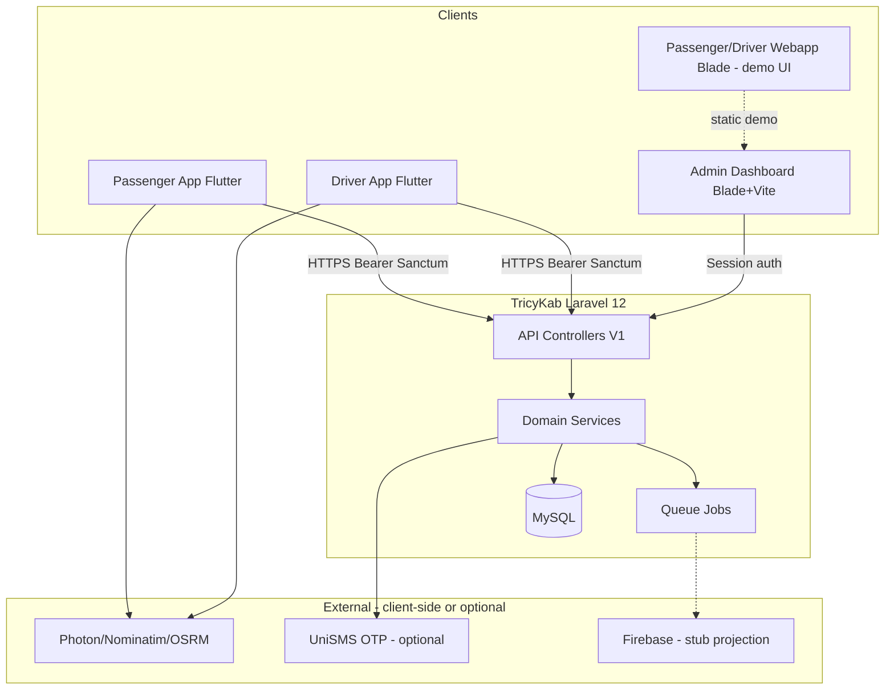
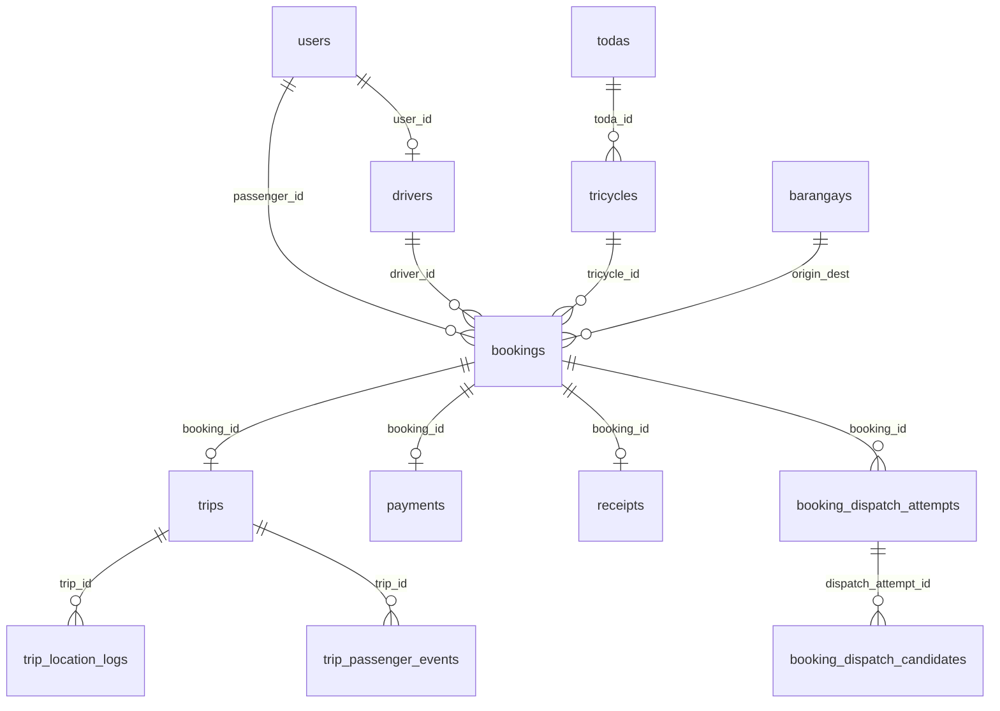

# TricyKab — System Documentation

Production-oriented system documentation for the **Kabacan Smart Tricycle Dispatch System** workspace at `System/`. Authoritative product rules live in `PRD_MD_V2.md`; this document reflects **what is implemented in code today**.

**Last derived from:** migrations, routes, services, and mobile clients in this repository.

---

## Repository layout

```
System/
├── PRD_MD_V2.md                 # Product spec (authoritative)
├── PRD_PROGRESS_AUDIT.md        # Implementation status tracker
├── DEPLOY.md                    # Pilot deployment guide
├── SYSTEM_DOCUMENTATION.md      # This file
├── TricyKab/                    # Laravel 12 backend + admin dashboard
├── Applications/
│   ├── passenger_app/           # Flutter passenger client
│   └── driver_app/              # Flutter driver client
```

---

## 1. Executive Summary & Project Overview

### Project Abstract

**TricyKab** (Kabacan Smart Tricycle Dispatch System) is a geolocation-based ride dispatch and trip-management platform for accredited tricycle transport in Kabacan, Cotabato, Philippines. It digitizes:

- Passenger ride requests (shared or special/pakyaw)
- Driver dispatch offers and acceptance
- Trip lifecycle (arrive → start → track → end)
- Cash payment recording and digital receipts
- SOS alerts, disputes, and LGU/TODA administrative oversight

The MVP targets **cash-first**, **OTP-based** mobile identity, and **REST polling** for live updates during the pilot (Firebase mirroring is stubbed).

### Target Audience / User Personas

| Persona | Client | Role in DB (`users.role`) | Primary goals |
|---------|--------|---------------------------|---------------|
| **Passenger** | Flutter `passenger_app` | `passenger` | Book rides, track driver, pay cash, rate driver, SOS, dispute |
| **Driver** | Flutter `driver_app` | `driver` (+ `drivers` row) | Go online, accept offers, execute trips, add walk-ins, record payment |
| **LGU Admin** | Laravel Blade admin | `admin`, `admin_scope=lgu` | Full fleet, fares, standby points, disputes, SOS, exports |
| **TMU Admin** | Laravel Blade admin | `admin`, `admin_scope=tmu` | System-wide monitoring (scoped in controllers) |
| **TODA Admin** | Laravel Blade admin | `admin`, `toda_id` set | TODA-scoped drivers/tricycles/trips |

---

## 2. System Architecture & Tech Stack

### High-Level Architecture

**Pattern:** Modular monolith (Laravel) exposing versioned REST JSON (`/api/v1/*`), with two Flutter mobile clients and a server-rendered admin web UI.



**State management (mobile):**

- **Passenger:** `PassengerRepository` (HTTP) + `PassengerBookingsStore` (`ChangeNotifier` via `PassengerBookingsScope`)
- **Driver:** `DriverFlowController` (`ChangeNotifier`) + `HttpDriverFlowRepository` + `DriverFlowScope`

**Transactional core:** Booking status transitions, dispatch accept (row locks), trip lifecycle, payments/receipts run in `App\Services\*` with `DB::transaction` and `AuditLogger`.

### Technology Stack Matrix

| Component | Language / Framework & Version | Key Dependencies / Libraries |
|-----------|-------------------------------|------------------------------|
| **Backend API & Admin** | PHP **^8.2**, Laravel **^12.0** | `laravel/sanctum` ^4.3, `barryvdh/laravel-dompdf` ^3.1, Pest ^3.8 (dev) |
| **Admin frontend assets** | Node (Vite **^7**), Tailwind **^3.1** | `alpinejs`, `axios`, `leaflet`, `leaflet.heat`, `apexcharts` |
| **Database** | **MySQL** 8 / MariaDB 10.6+ (configured; SQLite possible for dev) | Eloquent ORM, 41 migrations → 28 tables |
| **Passenger mobile** | Dart SDK **^3.10.7**, Flutter | `http`, `shared_preferences`, `flutter_map` ^7, `latlong2`, `geolocator` ^13, `google_fonts`, `intl` |
| **Driver mobile** | Dart SDK **^3.10.7**, Flutter | Same as passenger + `url_launcher` |
| **Maps / routing (clients)** | OpenStreetMap ecosystem | Photon (forward geocode), Nominatim (reverse), public OSRM routing API |
| **Auth** | Laravel Sanctum personal access tokens | Scoped abilities per role; 12h access / 30d refresh |
| **Realtime (pilot)** | REST polling | Passenger 4s; driver offers 6s; GPS ping 10s; Firebase job **stub** |
| **OTP (pilot)** | Hashed challenges in DB | `LogOtpSmsSender` or UniSMS when configured; dev OTP page when `APP_DEBUG=true` |

### System Constraints / Assumptions

| Area | Code reality vs PRD |
|------|---------------------|
| **Dispatch ranking** | `InitiateDispatchJob` selects up to `DISPATCH_MAX_CANDIDATES` **active ONLINE** drivers ordered by `id`; `distance_meters` on candidates is **0** (no haversine ranking yet). |
| **Firebase** | `FirebaseMirrorJob` logs only when `FIREBASE_PROJECTION_ENABLED=true`; pilot uses polling. |
| **Google Maps SDK** | PRD mentions Google Maps; apps use **flutter_map + OSM** services, not Google Maps SDK. |
| **SMS** | Without `UNISMS_API_SECRET_KEY`, OTP is logged / read from `Admin → Dev → OTP` when debug. |
| **Passenger webapp** | `routes/web.php` `/passenger-app/*` serves **static demo** Blade views, not wired to API. |
| **API base URL** | `main.dart` in both apps may hardcode an ngrok URL; `DEPLOY.md` documents `--dart-define=TRICYKAB_API_BASE=...`. |

---

## 3. Core Features & User Workflows

### 3.1 Authentication (OTP + Sanctum)

**Functional description:** Phone OTP for passengers/drivers; email/password registration path for passengers; Sanctum bearer tokens with role-specific scopes.

**Technical implementation:**

| Layer | Location |
|-------|----------|
| OTP lifecycle | `TricyKab/app/Services/Otp/OtpChallengeService.php` |
| Token issuance | `TricyKab/app/Services/Auth/TokenIssuer.php` |
| API | `OtpAuthController`, `PassengerAuthController` |
| Storage | `otp_challenges`, `personal_access_tokens` |
| Mobile | `Applications/passenger_app/lib/features/auth/screens/otp_login_screen.dart`, `Applications/driver_app/lib/features/auth/screens/otp_login_screen.dart` |

**User workflow (driver/passenger OTP):**

1. User enters phone → `POST /api/v1/auth/otp/request` with `role_hint` `PASSENGER` or `DRIVER`.
2. Backend hashes OTP into `otp_challenges`; optional UniSMS send; debug caches plaintext 5 min.
3. User enters OTP → `POST /api/v1/auth/otp/verify`.
4. `TokenIssuer` returns `access_token`, `refresh_token`, `user`, `scopes`.
5. App persists tokens in `shared_preferences` (`AppSettings`).
6. Subsequent requests: `Authorization: Bearer {access_token}`.

**Booking status machine** (`App\Models\Booking`):

```
CREATED → SEARCHING_DRIVER → DRIVER_ASSIGNED → DRIVER_ON_THE_WAY → DRIVER_ARRIVED
  → TRIP_IN_PROGRESS → COMPLETED
Terminal: CANCELLED_BY_*, CANCELLED_NO_DRIVER, NO_SHOW_*
```

**Trip status** (`App\Models\Trip`): `PRE_START` → `IN_PROGRESS` → `COMPLETED` | `ABORTED`

---

### 3.2 Passenger booking

**Functional description:** Create shared/special bookings with pickup/destination; fare estimate from `fare_matrices`; dispatch job queued.

**Technical implementation:**

| Layer | Location |
|-------|----------|
| Service | `PassengerBookingService::create()` |
| Fare | `FareCalculatorService` (haversine km → matrix) |
| Dispatch trigger | `InitiateDispatchJob::dispatch($bookingId)` |
| API | `PassengerBookingController` |
| Mobile | `Applications/passenger_app/lib/features/book/screens/book_ride_screen.dart`, `passenger_repository.dart`, `passenger_bookings_store.dart` |

**User workflow:**

1. Passenger selects pickup/destination (Photon/Nominatim + OSRM route preview client-side).
2. `POST /api/v1/bookings` with `Idempotency-Key` → booking `SEARCHING_DRIVER`, fare/distance stored.
3. Queue worker runs `InitiateDispatchJob` → `booking_dispatch_attempts` + `booking_dispatch_candidates`.
4. Passenger polls `GET /api/v1/bookings/{id}` or navigates to active trip when status advances.
5. Cancel: `POST /api/v1/bookings/{id}/cancel` with `reason_code`.

---

### 3.3 Driver dispatch & acceptance

**Functional description:** Online drivers receive dispatch offers; accept/decline with race-safe assignment; accept creates `trips` row `PRE_START`.

**Technical implementation:**

| Layer | Location |
|-------|----------|
| Offer listing | `DriverDispatchService::listPendingOffers()` |
| Accept/decline | `DriverDispatchService` (transactional) |
| API | `DriverDispatchController` |
| Mobile polling | `DriverFlowController.startOfferPolling` (6s default) |
| Auto UI | `DriverOfferAutoPresenter` |

**User workflow:**

1. Driver toggles online → `POST /api/v1/drivers/me/availability` (`ONLINE` + GPS).
2. App polls `GET /api/v1/drivers/me/dispatch-offers` every **6s**.
3. Driver accepts → `POST /api/v1/drivers/bookings/{booking}/accept` with `dispatch_attempt_id`, `candidate_id`.
4. Booking → `DRIVER_ASSIGNED`; trip created `PRE_START`; other candidates reconciled.
5. Decline → `POST .../decline` with `reason_code` stored on candidate.

---

### 3.4 Trip execution & tracking

**Functional description:** Driver progresses arrive → start → GPS logs → add walk-in passengers → end; passenger tracks via polling.

**Technical implementation:**

| Layer | Location |
|-------|----------|
| Trip mutations | `TripService` |
| API | `DriverTripController`, `PassengerTripController` |
| Location logs | `trip_location_logs` |
| Walk-ins | `trip_passenger_events` (`ADD_PASSENGER`) |
| Mobile driver | `assigned_pickup_screen.dart`, `trip_in_progress_screen.dart` |
| Mobile passenger | `active_trip_screen.dart` (poll **4s**) |

**User workflow:**

1. **Arrive:** `POST /api/v1/drivers/trips/{trip}/arrive` → booking `DRIVER_ARRIVED`.
2. **Start:** `POST .../start` → trip `IN_PROGRESS`, booking `TRIP_IN_PROGRESS`; location ping every **10s** via `POST .../location`.
3. **Add passengers:** `POST .../add-passengers` (`quantity`); enforces tricycle `capacity` → `409 DRIVER_CAPACITY_EXCEEDED`.
4. **End:** `POST .../end` → trip `COMPLETED`, booking `COMPLETED`.
5. Passenger polls `GET /api/v1/bookings/{booking}/trip-tracking` for driver position and status.

---

### 3.5 Payment, receipt, rating

**Technical implementation:** `PaymentRecordService`, `PaymentRecordController`, `TripRatingController`, tables `payments`, `receipts`.

**User workflow:**

1. Driver `POST /api/v1/payments/{booking}/record` (cash) → payment + receipt `RCT-{year}-{id}`.
2. Passenger `GET /api/v1/bookings/{booking}/receipt`.
3. Passenger `POST /api/v1/trips/{trip}/rate` with `rating` 1–5.

---

### 3.6 SOS & disputes

| Feature | API | Service / storage |
|---------|-----|-------------------|
| Passenger SOS | `POST /api/v1/passenger/sos` | `sos_alerts` |
| Driver SOS | `POST /api/v1/drivers/sos` | `sos_alerts` (+ driver fields) |
| Dispute | `POST /api/v1/bookings/{booking}/dispute` | `disputes` |
| Admin SOS | `GET/PATCH /admin/sos-alerts*` | `SosAlertController` (poll endpoint) |
| Admin disputes | `GET/PATCH /admin/disputes*` | LGU-only |

---

### 3.7 Admin dashboard

**Functional description:** Session-authenticated Blade UI for fleet CRUD, bookings map/export, analytics, audit logs, fare/standby management (LGU).

**Technical implementation:** `TricyKab/routes/web.php`, controllers under `App\Http\Controllers\Admin\`, views `resources/views/admin/`, assets `resources/js/admin/`.

**Middleware:** `auth`, `admin`, `lgu.only` (for sensitive routes).

---

### Key service map (backend)

| Service | Responsibility |
|---------|----------------|
| `OtpChallengeService` | OTP hash, rate limits, verify lockout |
| `TokenIssuer` | Sanctum access/refresh tokens + scopes |
| `PassengerBookingService` | Create/cancel/list bookings |
| `DriverDispatchService` | Offers, accept/decline/cancel |
| `TripService` | Arrive/start/end/location/add passengers |
| `PaymentRecordService` | Cash payment + receipt generation |
| `FareCalculatorService` | Shared/special fare from `fare_matrices` |
| `DriverAvailabilityService` | ONLINE/OFFLINE + last GPS on driver row |
| `AuditLogger` | Immutable audit trail |
| `DashboardMetricsService` / `AdminExportService` | Admin KPIs and CSV/PDF |

---

## 4. Data Architecture & Database Schema

### Database type

**Relational — MySQL** (default `DB_CONNECTION=mysql` in `.env.example`). Laravel framework tables (`jobs`, `cache`, `sessions`) included.

### Entity relationship (domain)



### Schema definition (from migrations)

Laravel defaults: `id()` = `BIGINT UNSIGNED` PK auto-increment; `string` = `VARCHAR(255)` unless length given; `foreignId` = `BIGINT UNSIGNED`; `timestamps()` = nullable `created_at` / `updated_at`.

#### `users`

| Column | Type | Nullable | Default | Notes |
|--------|------|----------|---------|-------|
| id | BIGINT UNSIGNED PK | NO | AI | |
| name | VARCHAR(255) | NO | | |
| email | VARCHAR(255) | NO | | UNIQUE |
| email_verified_at | TIMESTAMP | YES | | |
| password | VARCHAR(255) | NO | | hashed |
| role | VARCHAR(255) | NO | `admin` | `admin`, `passenger`, `driver` |
| phone | VARCHAR(255) | YES | | UNIQUE |
| phone_verified_at | TIMESTAMP | YES | | |
| first_name | VARCHAR(100) | YES | | |
| last_name | VARCHAR(100) | YES | | |
| home_address | VARCHAR(255) | YES | | |
| emergency_contact_name | VARCHAR(200) | YES | | |
| emergency_contact_phone | VARCHAR(32) | YES | | |
| profile_photo_url | VARCHAR(500) | YES | | |
| status | VARCHAR(20) | NO | `ACTIVE` | |
| fcm_token | VARCHAR(255) | YES | | |
| toda_id | BIGINT UNSIGNED | YES | | FK → `todas.id` SET NULL |
| admin_scope | VARCHAR(10) | YES | | `lgu`, `tmu` |
| remember_token | VARCHAR(100) | YES | | |
| created_at, updated_at | TIMESTAMP | YES | | |

#### `todas`

| Column | Type | Nullable | Default |
|--------|------|----------|---------|
| id | BIGINT PK | NO | AI |
| name | VARCHAR(255) | NO | UNIQUE |
| area_coverage | VARCHAR(255) | YES | |
| operating_hours | VARCHAR(255) | YES | |
| status | VARCHAR(255) | NO | `active` |
| created_at, updated_at | TIMESTAMP | YES | |

#### `tricycles`

| Column | Type | Nullable | Default |
|--------|------|----------|---------|
| id | BIGINT PK | NO | AI |
| body_number | VARCHAR(255) | NO | UNIQUE |
| plate_number | VARCHAR(255) | NO | UNIQUE |
| toda_id | BIGINT | NO | FK → `todas` CASCADE |
| make_model | VARCHAR(255) | YES | |
| status | VARCHAR(255) | NO | `active` |
| registration_status | VARCHAR(255) | NO | `ACTIVE` |
| capacity | TINYINT UNSIGNED | NO | `4` |
| created_at, updated_at | TIMESTAMP | YES | |

#### `drivers`

| Column | Type | Nullable | Default |
|--------|------|----------|---------|
| id | BIGINT PK | NO | AI |
| user_id | BIGINT | YES | UNIQUE → `users` SET NULL |
| first_name, last_name | VARCHAR(255) | NO | |
| license_number | VARCHAR(255) | NO | UNIQUE |
| contact_number | VARCHAR(255) | YES | |
| address | VARCHAR(255) | YES | |
| photo | VARCHAR(255) | YES | |
| rating | DECIMAL(3,2) | NO | `5.00` |
| acceptance_rate_snapshot | DECIMAL(5,2) | YES | |
| status | VARCHAR(255) | NO | `active` |
| availability_status | VARCHAR(20) | NO | `OFFLINE` |
| last_availability_at | TIMESTAMP | YES | |
| last_latitude, last_longitude | DECIMAL(10,7) | YES | |
| last_accuracy_meters | DECIMAL(10,2) | YES | |
| tricycle_id | BIGINT | YES | FK → `tricycles` SET NULL |
| toda_id | BIGINT | YES | FK → `todas` SET NULL |
| created_at, updated_at | TIMESTAMP | YES | |

#### `bookings`

| Column | Type | Nullable | Default |
|--------|------|----------|---------|
| id | BIGINT PK | NO | AI |
| booking_reference | VARCHAR(255) | YES | UNIQUE; auto `BK-{Y}-{id}` |
| passenger_id | BIGINT | YES | FK → `users` SET NULL |
| driver_id | BIGINT | YES | FK → `drivers` SET NULL |
| tricycle_id | BIGINT | YES | FK → `tricycles` SET NULL |
| pickup_lat, pickup_lng | DECIMAL(10,7) | YES | |
| pickup_address | VARCHAR(255) | YES | |
| pickup_notes | TEXT | YES | |
| destination_lat, destination_lng | DECIMAL(10,7) | YES | |
| destination_address | VARCHAR(255) | YES | |
| origin_barangay_id, destination_barangay_id | BIGINT | YES | FK → `barangays` |
| ride_type | VARCHAR(255) | NO | `shared` |
| status | VARCHAR(255) | NO | `CREATED` |
| fare_amount | DECIMAL(8,2) | YES | |
| distance_km | DECIMAL(8,2) | YES | |
| accepted_at, started_at, completed_at, cancelled_at | TIMESTAMP | YES | |
| cancellation_reason | VARCHAR(255) | YES | |
| passenger_ack_pickup_at, passenger_ack_dropoff_at | TIMESTAMP | YES | |
| created_at, updated_at | TIMESTAMP | YES | |

#### `booking_dispatch_attempts`

| Column | Type | Nullable | Default |
|--------|------|----------|---------|
| id | BIGINT PK | NO | AI |
| booking_id | BIGINT | NO | FK CASCADE |
| attempt_no | INT UNSIGNED | NO | UNIQUE(booking_id, attempt_no) |
| search_radius_meters | INT UNSIGNED | NO | |
| broadcast_started_at, broadcast_expires_at | TIMESTAMP | NO | |
| candidate_count | INT UNSIGNED | NO | `0` |
| winner_driver_id | BIGINT | YES | FK → `drivers` SET NULL |
| status | VARCHAR(20) | NO | |
| created_at, updated_at | TIMESTAMP | YES | |

#### `booking_dispatch_candidates`

| Column | Type | Nullable | Default |
|--------|------|----------|---------|
| id | BIGINT PK | NO | AI |
| dispatch_attempt_id | BIGINT | NO | FK CASCADE |
| driver_id | BIGINT | NO | FK CASCADE |
| rank_order | INT UNSIGNED | NO | |
| distance_meters | INT UNSIGNED | NO | |
| standby_score, fairness_score | DECIMAL(8,4) | NO | |
| total_score | DECIMAL(10,4) | NO | |
| response_status | VARCHAR(20) | NO | `PENDING` |
| responded_at | TIMESTAMP | YES | |
| decline_reason_code | VARCHAR(64) | YES | |
| UNIQUE(dispatch_attempt_id, driver_id) | | | |

#### `trips`

| Column | Type | Nullable | Default |
|--------|------|----------|---------|
| id | BIGINT PK | NO | AI |
| booking_id | BIGINT | NO | UNIQUE FK CASCADE |
| driver_id, passenger_id | BIGINT | NO | FK CASCADE |
| trip_status | VARCHAR(30) | NO | |
| started_at, ended_at | TIMESTAMP | YES | |
| start_latitude, start_longitude, end_latitude, end_longitude | DECIMAL(10,7) | YES | |
| computed_distance_meters | INT UNSIGNED | YES | |
| computed_duration_seconds | INT UNSIGNED | YES | |
| passenger_count | TINYINT UNSIGNED | NO | `1` |
| detour_seconds_over_initial_eta | INT UNSIGNED | YES | |
| gps_quality_status | VARCHAR(20) | NO | `NORMAL` |
| rating | TINYINT UNSIGNED | YES | |
| rated_at | DATETIME | YES | |
| end_method | VARCHAR(20) | YES | |

#### `trip_location_logs`

| Column | Type | Notes |
|--------|------|-------|
| id | BIGINT PK | |
| trip_id | BIGINT FK CASCADE | INDEX(trip_id, captured_at) |
| driver_id | BIGINT FK CASCADE | |
| latitude, longitude | DECIMAL(10,7) | |
| accuracy_meters | DECIMAL(10,2) | nullable |
| speed_mps, heading_degrees | DECIMAL(8,2) | nullable |
| captured_at | TIMESTAMP | |
| source | VARCHAR(20) | default `DRIVER_APP` |

#### `trip_passenger_events`

| Column | Type | Notes |
|--------|------|-------|
| id | BIGINT PK | |
| trip_id | BIGINT FK CASCADE | |
| event_type | VARCHAR(30) | e.g. walk-in add |
| quantity | TINYINT UNSIGNED | |
| notes | VARCHAR(255) | nullable |
| recorded_by_driver_id | BIGINT FK CASCADE | |

#### `payments`

| Column | Type | Notes |
|--------|------|-------|
| id | BIGINT PK | |
| booking_id | BIGINT UNIQUE FK CASCADE | |
| method | VARCHAR(255) | default `cash` |
| amount | DECIMAL(8,2) | |
| currency | CHAR(3) | default `PHP` |
| transaction_id | VARCHAR(255) | nullable |
| status | VARCHAR(255) | default `completed` |
| paid_at | TIMESTAMP | nullable |
| recorded_by_role | VARCHAR(20) | nullable |
| notes | VARCHAR(500) | nullable |

#### `receipts`

| Column | Type | Notes |
|--------|------|-------|
| id | BIGINT PK | |
| booking_id | BIGINT UNIQUE FK CASCADE | |
| receipt_number | VARCHAR(50) UNIQUE | |
| receipt_payload_json | JSON | |
| generated_at | TIMESTAMP | |

#### `fare_matrices`

| Column | Type | Default highlights |
|--------|------|-------------------|
| ride_type | VARCHAR | `shared` / `special` |
| base_fare, per_km_rate | DECIMAL(8,2) | |
| multiplier | DECIMAL(8,4) | `1.0000` |
| min_fare, max_fare | DECIMAL(8,2) | |
| minimum_distance | DECIMAL(8,2) | `2.0` |
| discount_percentage | DECIMAL(5,2) | `20.0` |
| per_passenger_addon, rush_hour_surcharge | DECIMAL(8,2) | |
| night_diff_percentage | DECIMAL(5,2) | |
| effective_date | DATE | |

#### `barangays`

| Column | Type |
|--------|------|
| id | BIGINT PK |
| name | VARCHAR UNIQUE |
| code | VARCHAR UNIQUE |

#### `standby_points`

| Column | Type | Default |
|--------|------|---------|
| name | VARCHAR | |
| toda_id, barangay_id | BIGINT FK nullable | |
| latitude, longitude | DECIMAL(10,7) | |
| radius_meters | INT | `50` |
| priority_weight | DECIMAL(5,2) | `1.00` |
| status | VARCHAR | `ACTIVE` |

#### `otp_challenges`

| Column | Type |
|--------|------|
| phone_number | VARCHAR(20) INDEX(phone, role_hint) |
| role_hint | VARCHAR(20) nullable |
| otp_hash | VARCHAR(255) |
| expires_at | DATETIME |
| verify_attempts, resend_count | TINYINT default 0 |
| locked_at, consumed_at | DATETIME nullable |

#### `disputes`

| Column | Type | Default |
|--------|------|---------|
| booking_id, driver_id | BIGINT FK nullable | |
| reported_by_role | VARCHAR | |
| reported_by_name | VARCHAR nullable | |
| dispute_type | VARCHAR | |
| description | TEXT | |
| status | VARCHAR | `OPEN` |
| resolution_notes | TEXT nullable | |
| resolved_by_admin_id | BIGINT FK nullable | |
| resolved_at | TIMESTAMP nullable | |
| INDEX(status, created_at), INDEX(driver_id, status) | | |

#### `sos_alerts`

| Column | Type | Default |
|--------|------|---------|
| booking_id, trip_id, passenger_id, driver_id | BIGINT FK nullable | |
| passenger_name, driver_name | VARCHAR nullable | |
| reporter_role | VARCHAR(20) | `PASSENGER` |
| latitude, longitude | DECIMAL(10,7) nullable | |
| location_note | VARCHAR nullable | |
| status | VARCHAR | `OPEN` |
| acknowledged_by_admin_id, closed_by_admin_id | BIGINT nullable | |
| acknowledged_at, closed_at | TIMESTAMP nullable | |

#### `audit_logs`

| Column | Type |
|--------|------|
| actor_user_id | BIGINT FK SET NULL |
| actor_type | VARCHAR default `USER` |
| actor_name | VARCHAR nullable |
| object_type | VARCHAR |
| object_id | BIGINT nullable |
| action | VARCHAR |
| previous_state_json, new_state_json, target_fields | JSON nullable |
| reason | TEXT nullable |
| ip_address, user_agent | VARCHAR nullable |
| INDEX(object_type, object_id), INDEX(action, created_at) | |

#### `idempotency_records`

| Column | Type |
|--------|------|
| key_hash | VARCHAR(128) UNIQUE |
| user_id | BIGINT indexed |
| method | VARCHAR(10) |
| path | VARCHAR(255) |
| response_status | SMALLINT |
| response_body | LONGTEXT |
| created_at | TIMESTAMP |

#### Framework tables (Laravel)

`personal_access_tokens`, `password_reset_tokens`, `sessions`, `cache`, `cache_locks`, `jobs`, `job_batches`, `failed_jobs` — standard Laravel 12 schemas per migrations `0001_01_01_*`.

### Migration source index (41 files)

| Migration file | Effect |
|----------------|--------|
| `0001_01_01_000000_create_users_table.php` | `users`, `password_reset_tokens`, `sessions` |
| `0001_01_01_000001_create_cache_table.php` | `cache`, `cache_locks` |
| `0001_01_01_000002_create_jobs_table.php` | `jobs`, `job_batches`, `failed_jobs` |
| `2026_02_14_164221_create_todas_table.php` | `todas` |
| `2026_02_14_164221_create_tricycles_table.php` | `tricycles` |
| `2026_02_14_164256_create_drivers_table.php` | `drivers` |
| `2026_02_14_164723_create_personal_access_tokens_table.php` | `personal_access_tokens` |
| `2026_02_14_165516_create_fare_matrices_table.php` | `fare_matrices` |
| `2026_02_15_010000_create_bookings_table.php` | `bookings` |
| `2026_02_15_010001_create_payments_table.php` | `payments` |
| `2026_04_13_120000_add_prd_columns_to_fare_matrices_table.php` | +`multiplier`, `min_fare`, `max_fare` |
| `2026_04_15_110000_create_barangays_table.php` | `barangays` + seed |
| `2026_04_15_110100_add_admin_map_columns_to_bookings_table.php` | +`booking_reference`, barangay FKs |
| `2026_04_15_110200_create_standby_points_table.php` | `standby_points` + seed |
| `2026_04_29_130000_add_registration_columns_to_tricycles_table.php` | +`registration_status`, `capacity` |
| `2026_04_29_130100_create_disputes_table.php` | `disputes` |
| `2026_04_29_130200_create_sos_alerts_table.php` | `sos_alerts` |
| `2026_04_29_130300_create_audit_logs_table.php` | `audit_logs` |
| `2026_05_02_120000_create_otp_challenges_table.php` | `otp_challenges` |
| `2026_05_02_120001_add_status_to_users_table.php` | +`users.status` |
| `2026_05_02_120002_add_user_id_to_drivers_table.php` | +`drivers.user_id` |
| `2026_05_03_100000_add_pickup_notes_to_bookings_table.php` | +`pickup_notes` |
| `2026_05_04_100000_create_booking_dispatch_attempts_table.php` | `booking_dispatch_attempts` |
| `2026_05_04_100100_create_booking_dispatch_candidates_table.php` | `booking_dispatch_candidates` |
| `2026_05_05_120000_add_availability_and_location_to_drivers_table.php` | driver location/availability |
| `2026_05_05_120100_add_decline_reason_code_to_booking_dispatch_candidates_table.php` | +`decline_reason_code` |
| `2026_05_05_200000_add_passenger_profile_fields_to_users_table.php` | passenger profile columns |
| `2026_05_05_200611_add_toda_id_to_users_table.php` | +`users.toda_id` |
| `2026_05_05_222000_add_unique_index_to_users_phone.php` | unique `phone` |
| `2026_05_06_100000_create_trips_table.php` | `trips` |
| `2026_05_06_100100_create_trip_passenger_events_table.php` | `trip_passenger_events` |
| `2026_05_06_100200_create_trip_location_logs_table.php` | `trip_location_logs` |
| `2026_05_06_120000_add_passenger_ack_columns_to_bookings_table.php` | passenger ack timestamps |
| `2026_05_06_210000_align_payments_table_pr.php` | payments PRD columns + unique booking |
| `2026_05_06_210100_create_receipts_table.php` | `receipts` |
| `2026_05_06_210200_add_sos_alerts_trip_foreign_key.php` | FK `sos_alerts.trip_id` |
| `2026_05_07_100000_create_idempotency_records_table.php` | `idempotency_records` |
| `2026_05_16_100000_add_metrics_and_audit_fields.php` | +`acceptance_rate_snapshot`, `target_fields` |
| `2026_05_16_100000_add_admin_scope_to_users_table.php` | +`admin_scope` |
| `2026_05_16_100100_add_rating_to_trips_and_fcm_to_users.php` | +`trips.rating/rated_at`, `users.fcm_token` |
| `2026_05_18_100000_add_driver_fields_to_sos_alerts_table.php` | +SOS driver/reporter fields |

---

## 5. API & Communication Protocols

### Authentication mechanism

- **Mobile API:** Laravel **Sanctum** personal access tokens (`Authorization: Bearer {token}`).
- **Token pair:** `access_token` (12 hours, role scopes) + `refresh_token` (30 days, `refresh` ability).
- **Admin web:** Session guard + Breeze-style auth (`routes/auth.php`); middleware `admin`, `lgu.only`.
- **Abilities:** Enforced per route via middleware aliases in `bootstrap/app.php` (e.g. `booking:create`, `trip:end:self`).
- **Idempotency:** Optional header `Idempotency-Key` (≤200 chars) on mutating routes; replays stored in `idempotency_records`.

### Rate limits (`AppServiceProvider`)

| Bucket | Limit | Key |
|--------|-------|-----|
| `otp-request` | 5/hour | `phone_number` |
| `otp-verify` | 10/hour | `phone_number` |
| `api` | 120/minute | authenticated `user_id` or IP |

### Standard JSON envelope

```json
{
  "success": true,
  "data": { }
}
```

```json
{
  "success": false,
  "error": {
    "code": "VALIDATION_ERROR",
    "message": "Human-readable message",
    "details": { }
  }
}
```

### Core endpoints (complete `/api/v1` surface)

Base: **`https://{host}/api/v1`**

#### Health

| Method | Path | Auth | Success |
|--------|------|------|---------|
| GET | `/ping` | None | `{ "ok": true, "service": "tricykab", "timestamp": "...", "version": "..." }` |

#### OTP & passenger auth (public)

| Method | Path | Throttle | Request body | Success `data` |
|--------|------|----------|--------------|----------------|
| POST | `/auth/otp/request` | otp-request | `{ "phone_number": "string", "role_hint": "PASSENGER\|DRIVER", "device_id?": "string" }` | `{ "challenge_expires_in_seconds": 300, "resend_available_in_seconds": 60 }` |
| POST | `/auth/otp/verify` | otp-verify | `{ "phone_number", "otp_code": "6 digits", "device_id?" }` | `{ "access_token", "refresh_token", "user": { "id", "role", "status" }, "scopes": [] }` |
| POST | `/passenger/register` | otp-request | `{ "email", "password", "first_name", "last_name", "phone_number" }` | `{ "user_id", "challenge_expires_in_seconds", "resend_available_in_seconds" }` |
| POST | `/passenger/verify-phone` | otp-verify | `{ "email", "phone_number", "otp_code" }` | `{ "verified": true, "phone_verified_at": "ISO8601" }` |
| POST | `/passenger/login` | otp-verify | `{ "email", "password", "device_id?" }` | Same as OTP verify |

**Passenger scopes (OTP):** `booking:create`, `booking:read:self`, `booking:cancel:self`, `trip:read:self`, `receipt:read:self`, `sos:create:self`, `dispute:create:self`

**Driver scopes (OTP):** `availability:update:self`, `booking:read:self`, `booking:offer:read:self`, `booking:accept:self`, `booking:decline:self`, `booking:cancel:self`, `trip:start:self`, `trip:end:self`, `trip:update:self`, `passenger:add:self`, `payment:record:self`, `earnings:read:self`, `compliance:read:self`, `sos:create:self`, `dispute:create:self`

**OTP error codes:** `VALIDATION_ERROR` 422, `RATE_LIMITED` 429, `OTP_LOCKED` 423, `OTP_RATE_LIMIT_EXCEEDED` 429, `FORBIDDEN` 403, `RESOURCE_NOT_FOUND` 422 (driver not registered).

#### Passenger (Bearer + scopes)

| Method | Path | Middleware | Body | Success highlights |
|--------|------|------------|------|-------------------|
| GET | `/passenger/me/profile` | passenger.verified | — | `{ "profile": { ... } }` |
| POST | `/passenger/me/profile` | passenger.verified | `{ home_address?, emergency_contact_*, profile_photo_url? }` | profile object |
| POST | `/bookings` | passenger.booking, idempotent | `{ "ride_type": "SHARED\|SPECIAL", "pickup": { latitude, longitude, address, notes? }, "destination": { latitude, longitude, address } }` | `{ "booking": { id, reference, status, ride_type, estimated_*, pickup, destination, ... } }` |
| GET | `/bookings` | passenger.booking.read | Query `active=true` | `{ "bookings": [ ... ] }` |
| GET | `/bookings/{booking}` | passenger.booking.read | — | `{ "booking": { ... } }` |
| POST | `/bookings/{booking}/cancel` | passenger.booking.cancel, idempotent | `{ "reason_code", "notes?" }` | `{ "booking_id", "status": "CANCELLED_BY_PASSENGER" }` |
| GET | `/bookings/{booking}/trip-tracking` | passenger.booking.read, passenger.trip.read | — | `{ receipt_available, booking, driver?, trip? }` |
| POST | `/bookings/{booking}/passenger-ack` | + idempotent | `{ "kind": "pickup\|dropoff" }` | `{ "booking": { id, status, passenger_ack_* } }` |
| GET | `/bookings/{booking}/receipt` | passenger.receipt.read | — | `{ receipt_number, generated_at, payload, trip_id, can_rate, ... }` |
| POST | `/trips/{trip}/rate` | passenger.trip.read, idempotent | `{ "rating": 1-5 }` | `{ trip_id, rating, rated_at, driver_rating_avg, idempotent }` |
| POST | `/bookings/{booking}/dispute` | idempotent | `{ "dispute_type": "FARE\|NO_SHOW\|GPS\|CONDUCT\|SAFETY\|OTHER", "description": "10-1000 chars" }` | 201 `{ dispute_id, status: "OPEN", ... }` |
| POST | `/passenger/sos` | passenger.sos | `{ booking_id?, latitude, longitude, notes? }` | `{ sos_alert_id, status: "OPEN", created_at }` |

#### Driver (Bearer + scopes)

| Method | Path | Middleware | Body | Success highlights |
|--------|------|------------|------|-------------------|
| POST | `/drivers/me/availability` | driver.availability | `{ "driver_status": "ONLINE\|OFFLINE", latitude?, longitude?, accuracy_meters? }` | `{ driver_id, driver_status, effective_at }` |
| GET | `/drivers/me/profile` | driver.profile.read | — | `{ driver, toda?, tricycle? }` |
| GET | `/drivers/me/bookings` | driver.booking.read | `active?` | `{ "bookings": [ ... ] }` |
| GET | `/drivers/me/bookings/{booking}` | driver.booking.read | — | `{ "booking": { ... } }` |
| GET | `/drivers/me/dispatch-offers` | driver.dispatch.offers | — | `{ "offers": [{ candidate_id, dispatch_attempt_id, expires_at, countdown_seconds, booking, display }] }` |
| POST | `/drivers/bookings/{booking}/accept` | driver.booking.accept, idempotent | `{ dispatch_attempt_id, candidate_id, driver_location? }` | `{ booking_id, trip_id, status, grace_cancel_expires_at }` |
| POST | `/drivers/bookings/{booking}/decline` | driver.booking.decline | `{ dispatch_attempt_id, candidate_id, reason_code }` | `{ status: "DECLINED", booking_id }` |
| POST | `/drivers/bookings/{booking}/cancel` | driver.booking.cancel, idempotent | `{ reason_code, notes? }` | `{ booking_id, status, cancelled_at }` |
| POST | `/drivers/trips/{trip}/arrive` | driver.trip.update | geo body | `{ trip object }` |
| POST | `/drivers/trips/{trip}/location` | driver.trip.update | `{ latitude, longitude, accuracy_meters?, ... }` | `{ trip_id, recorded_at }` |
| POST | `/drivers/trips/{trip}/start` | driver.trip.start, idempotent | geo body | trip object |
| POST | `/drivers/trips/{trip}/add-passengers` | driver.trip.passengers | `{ quantity: 1-20, notes? }` | trip object; **409** `DRIVER_CAPACITY_EXCEEDED` |
| POST | `/drivers/trips/{trip}/end` | driver.trip.end, idempotent | geo body | trip object |
| POST | `/payments/{booking}/record` | driver.payment.record, idempotent | `{ amount, method?, recorded_by_role?, notes? }` | `{ payment, receipt }` |
| POST | `/drivers/sos` | driver.sos | same as passenger SOS | `{ sos_alert_id, reporter_role: "DRIVER", ... }` |

**Dispatch errors:** `DISPATCH_RACE_LOST` 409, `INVALID_OFFER` / `OFFER_EXPIRED` 422.

### Middleware reference

All return `ApiResponse::error('FORBIDDEN', message, 403)` unless noted.

| Alias | Role | Required Sanctum ability | Extra checks |
|-------|------|--------------------------|--------------|
| `passenger.verified` | Passenger | — | `phone_verified_at` set |
| `passenger.booking` | Passenger | `booking:create` | |
| `passenger.booking.read` | Passenger | `booking:read:self` | |
| `passenger.booking.cancel` | Passenger | `booking:cancel:self` | |
| `passenger.trip.read` | Passenger | `trip:read:self` | |
| `passenger.receipt.read` | Passenger | `receipt:read:self` | |
| `passenger.sos` | Passenger | `sos:create:self` | |
| `driver.availability` | Driver | `availability:update:self` | |
| `driver.profile.read` | Driver | `compliance:read:self` | |
| `driver.booking.read` | Driver | `booking:read:self` | |
| `driver.dispatch.offers` | Driver | `booking:offer:read:self` | |
| `driver.booking.accept` | Driver | `booking:accept:self` | Driver profile linked; driver `status === active` |
| `driver.booking.decline` | Driver | `booking:decline:self` | |
| `driver.booking.cancel` | Driver | `booking:cancel:self` | |
| `driver.trip.update` | Driver | `trip:update:self` | |
| `driver.trip.start` | Driver | `trip:start:self` | |
| `driver.trip.end` | Driver | `trip:end:self` | |
| `driver.trip.passengers` | Driver | `passenger:add:self` | |
| `driver.payment.record` | Driver | `payment:record:self` | |
| `driver.sos` | Driver | `sos:create:self` | |

**Idempotency (`Idempotency-Key`):** Empty header → pass-through. Header >200 chars → `VALIDATION_ERROR` 422. Valid key → replay first stored JSON + status for same user/method/path. Stores responses with status < 500 only.

### Cross-cutting error codes

| Code | Typical HTTP |
|------|----------------|
| `VALIDATION_ERROR` | 422 |
| `FORBIDDEN` | 403 |
| `RESOURCE_NOT_FOUND` | 404 / 422 |
| `NOT_FOUND` | 404 |
| `INVALID_STATE` | 422 |
| `BOOKING_NOT_CANCELLABLE` | 409 / 422 |
| `DISPATCH_RACE_LOST` | 409 |
| `INVALID_OFFER` / `OFFER_EXPIRED` | 422 |
| `CONFLICT_STATE` | 422 |
| `DRIVER_CAPACITY_EXCEEDED` | 409 |
| `DISPUTE_ALREADY_OPEN` | 409 |
| `TRIP_NOT_COMPLETED` | 422 |
| `OTP_LOCKED` | 423 |
| `RATE_LIMITED` / throttle codes | 429 |

### Admin web routes (session auth, not JSON API)

Prefix **`/admin`** (middleware `auth`, `admin`):

| Area | Routes |
|------|--------|
| Dashboard | `GET /admin/dashboard`, exports CSV/PDF |
| Fleet | `resource tricycles`, `resource drivers` |
| Bookings | `GET bookings`, `GET bookings/{reference}`, override/receipt/dispute AJAX |
| Analytics | `GET analytics` |
| LGU only | `resource todas`, fares, standby-points CRUD, disputes, SOS, audit-logs |
| Dev | `GET /admin/dev/otp` (only if `APP_DEBUG=true`) |

Public demo webapps: `/passenger-app/*`, `/driver-app/*` (static Blade).

### Real-time communication

| Mechanism | Interval / trigger | Purpose |
|-----------|---------------------|---------|
| **REST polling (passenger)** | 4s on active trip | `GET /bookings/{id}/trip-tracking` |
| **REST polling (driver)** | 6s when online | `GET /drivers/me/dispatch-offers` |
| **GPS ping (driver)** | 10s in trip | `POST /drivers/trips/{id}/location` |
| **Idle availability ping** | 30s when online | availability endpoint |
| **Admin SOS poll** | AJAX | `GET /admin/sos-alerts/poll` |
| **Firebase mirror (queued)** | On trip mutations if enabled | `FirebaseMirrorJob` — **stub** (logs only) |
| **WebSockets** | Not implemented in pilot | — |

---

## 6. Development Setup & Environment Configuration

### Prerequisites

| Software | Version (from repo) |
|----------|---------------------|
| PHP | 8.2+ (DEPLOY recommends 8.3) |
| Composer | 2.6+ |
| MySQL / MariaDB | 8 / 10.6+ |
| Node.js + npm | For Vite admin assets |
| Flutter SDK | 3.10.x (`sdk: ^3.10.7` in pubspec) |
| Android SDK | APK builds only |

PHP extensions: `pdo_mysql`, `mbstring`, `bcmath`, `xml`, `curl`, `zip`, `gd`.

### Environment variables

#### Backend (`TricyKab/.env`)

```dotenv
# Application
APP_NAME=TricyKab
APP_ENV=local
APP_KEY=                          # php artisan key:generate
APP_DEBUG=true                    # false in production; enables /admin/dev/otp when true
APP_URL=http://localhost:8000
APP_LOCALE=en
APP_FALLBACK_LOCALE=en
APP_FAKER_LOCALE=en_US
APP_MAINTENANCE_DRIVER=file
BCRYPT_ROUNDS=12

# Logging
LOG_CHANNEL=stack
LOG_STACK=single
LOG_DEPRECATIONS_CHANNEL=null
LOG_LEVEL=debug

# Database
DB_CONNECTION=mysql
DB_HOST=127.0.0.1
DB_PORT=3306
DB_DATABASE=tricykab
DB_USERNAME=root
DB_PASSWORD=

# Session / queue / cache
SESSION_DRIVER=database
SESSION_LIFETIME=120
SESSION_ENCRYPT=false
SESSION_PATH=/
SESSION_DOMAIN=null
QUEUE_CONNECTION=database
CACHE_STORE=database
BROADCAST_CONNECTION=log
FILESYSTEM_DISK=local

# Redis (optional)
REDIS_CLIENT=phpredis
REDIS_HOST=127.0.0.1
REDIS_PASSWORD=null
REDIS_PORT=6379

# Mail (optional)
MAIL_MAILER=log
MAIL_HOST=127.0.0.1
MAIL_PORT=2525
MAIL_FROM_ADDRESS="hello@example.com"
MAIL_FROM_NAME="${APP_NAME}"

# AWS (optional file storage)
AWS_ACCESS_KEY_ID=
AWS_SECRET_ACCESS_KEY=
AWS_DEFAULT_REGION=us-east-1
AWS_BUCKET=

# Vite
VITE_APP_NAME="${APP_NAME}"

# OTP SMS (UniSMS) — leave blank to log OTP only
UNISMS_API_SECRET_KEY=
UNISMS_SENDER_ID=TricyKab
UNISMS_BASE_URL=https://unismsapi.com/api

# Booking heuristics
BOOKING_SEARCH_RADIUS_METERS=1000
BOOKING_AVERAGE_SPEED_KMH=25

# Dispatch
DISPATCH_MAX_CANDIDATES=5
DISPATCH_OFFER_TTL=60

# Firebase projection (stub)
FIREBASE_PROJECTION_ENABLED=false
FIREBASE_SERVICE_ACCOUNT_PATH=storage/firebase-service-account.json
FIREBASE_PROJECT_ID=
```

#### Mobile clients

| Mechanism | Key / constant | Description |
|-----------|----------------|-------------|
| Build-time | `--dart-define=TRICYKAB_API_BASE=http://host:8000/api/v1` | Recommended API base (see `DEPLOY.md`) |
| Runtime | `shared_preferences`: `tricykab_access_token`, `tricykab_refresh_token`, `tricykab_last_phone`, `tricykab_last_email` | Persisted in `AppSettings` |
| Code constant | `kApiBase` in `lib/main.dart` | May be hardcoded for tunnel testing — override for local dev |

No `.env` file in Flutter projects; API base is compile-time unless extended via Settings UI.

### Step-by-step installation

#### 1. Database

```bash
mysql -uroot -p
CREATE DATABASE tricykab CHARACTER SET utf8mb4 COLLATE utf8mb4_unicode_ci;
```

#### 2. Backend

```bash
cd TricyKab
cp .env.example .env
composer install
php artisan key:generate
# Edit .env with DB credentials
php artisan migrate --seed
npm install
npm run build
```

**Seeded admin:** `admin@tricykab.test` / `password`  
**Sample drivers:** phones `+6391711xxxxx` (see `database/seeders/DatabaseSeeder.php`)

#### 3. Run backend (development)

```bash
# All-in-one (server + queue + vite) per composer.json:
composer dev

# Or separately:
php artisan serve --host 0.0.0.0 --port 8000
php artisan queue:work --tries=3
npm run dev
```

Health check: `GET http://localhost:8000/up`  
Admin: `http://localhost:8000/login`

#### 4. Passenger app

```bash
cd Applications/passenger_app
flutter pub get
flutter run --dart-define=TRICYKAB_API_BASE=http://10.0.2.2:8000/api/v1
```

Update `kApiBase` in `lib/main.dart` if not using dart-define consistently.

#### 5. Driver app

```bash
cd Applications/driver_app
flutter pub get
flutter run --dart-define=TRICYKAB_API_BASE=http://10.0.2.2:8000/api/v1
```

#### 6. Release APKs (pilot)

```bash
flutter build apk --release --dart-define=TRICYKAB_API_BASE=http://<lan-ip>:8000/api/v1
```

See `DEPLOY.md` for nginx, systemd queue worker, ngrok, and E2E demo script.

---

## Related documents

| Document | Purpose |
|----------|---------|
| `PRD_MD_V2.md` | Authoritative product spec and target behavior |
| `PRD_PROGRESS_AUDIT.md` | Implementation status vs PRD |
| `DEPLOY.md` | Pilot deployment and operations |
| `AGENTS.md` | Agent workflow rules for this repo |

For normative MVP behavior not yet implemented (full geo dispatch scoring, Firebase sync, production SMS), treat `PRD_MD_V2.md` as the target spec and `PRD_PROGRESS_AUDIT.md` as the gap list.
